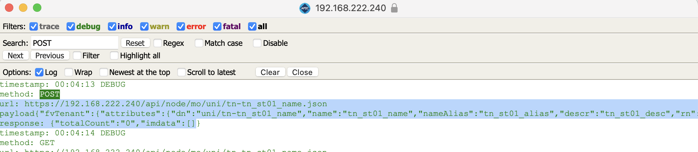
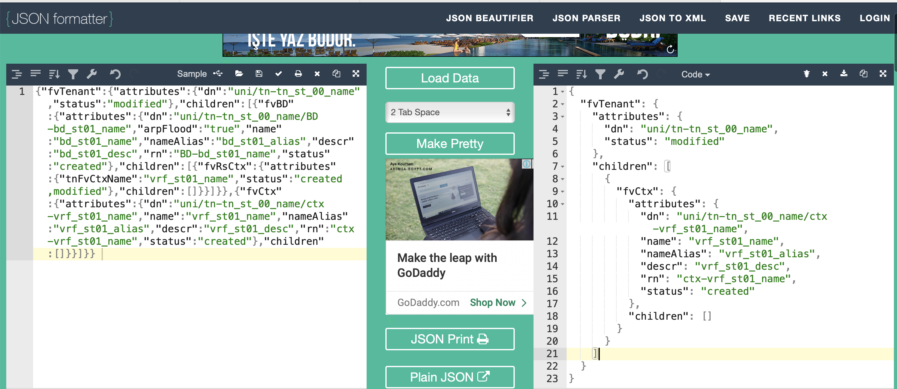

## **APIC Controller API**

Cisco Application Centric Infrastructure (ACI) is Cisco's software-defined networking (SDN) solution designed to improve network agility and data center automation. Python, as a versatile and powerful programming language, can be used to interact with Cisco ACI to automate network tasks, manage configurations, and extract useful data.

Here’s an overview of how Python interacts with Cisco ACI from a network engineer’s perspective:

### APIC: The Central Controller

The Cisco Application Policy Infrastructure Controller (APIC) is the central controller for ACI. All interactions with ACI are done through the APIC, which provides a RESTful API interface for programmatic access. 

### REST API

The REST API is the primary method for interacting with the APIC. Python can be used to send HTTP requests to the APIC, allowing you to perform operations such as creating, reading, updating, and deleting network configurations and policies.

### Python Libraries for Cisco ACI

There are several Python libraries and modules available that simplify the process of interacting with the ACI REST API:

- **Requests Library**: A simple HTTP library for Python that allows sending HTTP requests to the APIC.
- **Cisco ACI Toolkit**: A collection of Python utilities and libraries to interact with ACI.

### Authentication

Before performing any operations, you need to authenticate with the APIC using credentials. The APIC will provide a token that needs to be included in subsequent requests.

## **Interact With ACI**

Let's walk through a basic example of how to interact with Cisco ACI using Python:

### Setup and Authentication

First, install the necessary Python libraries:
```bash
pip install requests
```

Next, write a Python script to authenticate with the APIC and obtain a token:

```python
import json
import requests
import urllib3

try:

	def login(url, username, password):
        # define base URL
		base_url = f'https://{url}/api/'

        # create credentials structure
		name_pwd = {'aaaUser': {'attributes': {'name': username, 'pwd': password}}}
		json_credentials = json.dumps(name_pwd)
        
        # log in to API
		login_url = base_url + 'aaaLogin.json'
        
        # disable warnings about SSL
		urllib3.disable_warnings(urllib3.exceptions.InsecureRequestWarning)
		response = requests.post(url=login_url, data=json_credentials, verify=False)
        
        # get token from login response structure
		data = response.json()
		token = data['imdata'][0]['aaaLogin']['attributes']['token']
		print ('Getting TOKEN Succesfully')
		return token

except Exception as e:

	#Print error code and explaination
	print (f'Error: {e}')
login(url='192.168.222.240',username='admin',password='Aa123456')
```

## Some Use Cases
### Get Data

Now that you have a token, you can use it to retrieve data from the APIC. For example, to get a list of `tenant`s:

```python
import requests
import urllib3
from a_aci_login import login

token = login(url="192.168.222.240",username="admin",password="Aa123456")

url = "192.168.222.240"
base_url = f"https://{url}/api/"

headers = {
	"Cookie": f"APIC-cookie={token}"
}

urllib3.disable_warnings(urllib3.exceptions.InsecureRequestWarning)

tenant_list = base_url + "node/class/fvTenant.json"
response = requests.get(tenant_list, headers=headers, verify=False)

tenants = response.json()['imdata']

for tenant in tenants:
    print(tenant['fvTenant']['attributes']['name'])

```

### Create Tenant

For creating any object, you can use `API Inspector` for finding `payload` that push `ACI` easily. To create a object for example  `tenant`, before sending script to ACI, configure creating tenant by `GUI`and observe on `API Inspector`.


```shell

url: https://192.168.222.240/api/node/mo/uni/tn-tn_st01_name.json

payload{"fvTenant":{"attributes":{"dn":"uni/tn-tn_st01_name",
"name":"tn_st01_name","nameAlias":"tn_st01_alias","descr":"tn_st01_desc",
"rn":"tn-tn_st01_name","status":"created"},"children":[]}}

```


```python
import requests
import urllib3
import json
from a_aci_login import login

tn_name = "tn_st_01_name"
tn_alias = "tn_st_01_alias"
tn_desc = "tn_st_01_desc"

################# SCRIPT #################

url = "192.168.222.240"
token = login (url="192.168.222.240",username="admin",password="Aa123456")
base_url = f"https://{url}/api"

pre_payload = {
    "fvTenant":{
        "attributes":{
            "dn":f"uni/tn-{tn_name}",
            "name":f"{tn_name}",
            "nameAlias":f"{tn_alias}",
            "descr":f"{tn_desc}",
            "rn":f"tn-{tn_name}",
            "status":"created"},
            "children":[]
            }           
}

payload = json.dumps(pre_payload)
create_tenant_url = base_url+f"/node/mo/uni/tn-{tn_name}.json"

try:
    def create_tenant ():
        urllib3.disable_warnings(urllib3.exceptions.InsecureRequestWarning)
        response = requests.post(url=create_tenant_url,
                                cookies={"APIC-Cookie":token},
                                data=payload,
                                verify=False)
        if response.status_code == 200 :
            print (f"Creating tenant {tn_name} succesfully")
            print (response)
        else:
            print (response)
except Exception as e:
    print (f"Error occurred {e}")

create_tenant()

```

### Create VRF

```bash
url: https://192.168.222.240/api/node/mo/uni/tn-tn_st01_name.json

payload{"fvTenant":{"attributes":{"dn":"uni/tn-tn_st_00_name",
"status":"modified"},"children":[{"fvBD":{"attributes":
{"dn":"uni/tn-tn_st_00_name/BD-bd_st01_name","arpFlood":"true",
"name":"bd_st01_name","nameAlias":"bd_st01_alias","descr":"bd_st01_desc",
"rn":"BD-bd_st01_name","status":"created"},"children":[{"fvRsCtx":
{"attributes":{"tnFvCtxName":"vrf_st01_name","status":"created,modified"},
"children":[]}}]}},{"fvCtx":{"attributes":
{"dn":"uni/tn-tn_st01_name/ctx-vrf_st01_name","name":"vrf_st01_name",
"nameAlias":"vrf_st01_alias","descr":"vrf_st01_desc","rn":"ctx-vrf_st01_name","status":"created"},"children":[]}}]}} 
```

You can use `Json Formatter` to regulate json data. 



**Note** : Erase `Bridge Domain` piece in Json data, because `VRF` should be generate first, then create `Bridige Domain` with using `VRF` .

```python
import requests
import urllib3
import json
from a_aci_login import login

tn_name = "tn_st01_name"
vrf_name = "vrf_st01_name"
vrf_alias = "vrf_st01_alias"
vrf_desc = "vrf_st01_desc"
url = '192.168.222.240'
username = "admin"
password = "Aa123456"

################# SCRIPT #################

token =  login(url,username,password)
base_url = f"https://{url}/api"
pre_payload = {
  "fvTenant": {
    "attributes": {
      "dn": f"uni/tn-{tn_name}",
      "status": "modified"
    },
    "children": [
      {
        "fvCtx": {
          "attributes": {
            "dn": f"uni/tn-{tn_name}/ctx-{vrf_name}",
            "name": vrf_name,
            "nameAlias": vrf_alias,
            "descr": vrf_desc,
            "rn": f"ctx-{vrf_name}",
            "status": "created"
          },
          "children": []
        }
      }
    ]
  }
}

payload = json.dumps(pre_payload)
create_vrf_url = base_url + f"/node/mo/uni/tn-{tn_name}.json"

try:
    def create_vrf ():
        print (create_vrf_url)
        response = requests.post(url = create_vrf_url,
                                data = payload,
                                cookies={"APIC-Cookie":token},
                                verify=False)
        if response.status_code == 200:
            print (f"{vrf_name} is created")
        else:
            print (f"error is occurred : {response.status_code} {response}")
except Exception as e:
    print (f"error is occured : {e}")

create_vrf()

```

### Create Bridge Domain

After creating `VRF` now, we can create `Bridge Domain` over `API`. Firstly create `Bridge Domain` on `GUI` pull relevant payload from `API inspector`

```shell
url: https://192.168.222.240/api/node/mo/uni/tn-tn_st01_name/BD-bd_st01_name.json

payload{"fvBD":{"attributes":{"dn":"uni/tn-tn_st01_name/BD-bd_st01_name",
"mac":"00:22:BD:F8:19:FF","arpFlood":"true","name":"bd_st01_name",
"nameAlias":"bd_st01_alias","descr":"bd_st01_desc","rn":"BD-bd_st01_name",
"status":"created"},"children":[{"fvRsCtx":{"attributes":
{"tnFvCtxName":"vrf_st01_name","status":"created,modified"},
"children":[]}}]}} 
```

```python
import requests
import urllib3
import json
from a_aci_login import login

tn_name = "tn_st01_name"
bd_name = "bd_st01_name"
vrf_name = "vrf_st01_name"
bd_alias = "bd_st01_alias"
bd_desc = "bd_st01_desc"
url = '192.168.222.240'
username = "admin"
password = "Aa123456"

################# SCRIPT #################

token =  login(url,username,password)
base_url = f"https://{url}/api"
pre_payload = {
  "fvBD": {
    "attributes": {
      "dn": f"uni/tn-{tn_name}/BD-{bd_name}",
      "mac": "00:22:BD:F8:19:FF",
      "arpFlood": "true",
      "name": bd_name,
      "nameAlias": bd_alias,
      "descr": bd_desc,
      "rn": f"BD-{bd_name}",
      "status": "created"
    },
    "children": [
      {
        "fvRsCtx": {
          "attributes": {
            "tnFvCtxName": vrf_name,
            "status": "created,modified"
          },
          "children": []
        }
      }
    ]
  }
}
  

payload = json.dumps(pre_payload)
create_bd_url = base_url + f"/node/mo/uni/tn-{tn_name}/BD-{bd_name}.json"

try:
    def create_bridge_domain ():
        response = requests.post(url = create_bd_url,
                                data = payload,
                                cookies={"APIC-Cookie":token},
                                verify=False)
        if response.status_code == 200:
            print (f"{bd_name} is created")
        else:
            print (f"error is occurred : {response.status_code} {response}")
except Exception as e:
    print (f"error is occured : {e}")

create_bridge_domain()
```

### Create Application Profile

```shell

url: https://192.168.222.240/api/node/mo/uni/tn-tn_st01_name/ap-ap_st01_name.json

{"fvAp":{"attributes":{"dn":"uni/tn-tn_st01_name/ap-ap_st01_name","name":"ap_st01_name","nameAlias":"ap_st01_alias","descr":"ap_st01_desc","rn":"ap-ap_st01_name","status":"created"},"children":[]}}
```

```python
import requests
import urllib3
import json
from a_aci_login import login

tn_name = "tn_st01_name"
app_name = "app_st01_name"
app_alias = "app_st01_alias"
app_desc = "app_st01_desc"
url = '192.168.222.240'
username = "admin"
password = "Aa123456"

################# SCRIPT #################

token =  login(url,username,password)
base_url = f"https://{url}/api"

pre_payload = {
  "fvAp": {
    "attributes": {
      "dn": f"uni/tn-{tn_name}/ap-{app_name}",
      "name": app_name,
      "nameAlias": app_alias,
      "descr": app_desc,
      "rn": f"ap-{app_name}",
      "status": "created"
    },
    "children": []
  }
}
  
payload = json.dumps(pre_payload)
create_app_url = base_url + f"/node/mo/uni/tn-{tn_name}/ap-{app_name}.json"

try:
    def create_app_profile ():
        response = requests.post(url = create_app_url,
                                data = payload,
                                cookies={"APIC-Cookie":token},
                                verify=False)
        if response.status_code == 200:
            print (f"{app_name} is created")
        else:
            print (f"error is occurred : {response.status_code} {response}")
except Exception as e:
    print (f"error is occured : {e}")

create_app_profile()
```

### Create EPG

```shell
url: https://192.168.222.240/api/node/mo/uni/tn-tn_st01_name/ap-app_st01_name/epg-epg_st01_name.json 

{"fvAEPg":{"attributes":{"dn":"uni/tn-tn_st01_name/ap-app_st01_name/epg-epg_st01_name","prio":"level3","name":"epg_st01_name","nameAlias":"epg_st01_alias","descr":"epg_st01_desc","rn":"epg-epg_st01_name","status":"created"},"children":[{"fvRsBd":{"attributes":{"tnFvBDName":"bd_st01_name","status":"created,modified"},"children":[]}}]}}
```

```python
import requests
import urllib3
import json
from a_aci_login import login

tn_name = "tn_st01_name"
epg_name = "epg_st01_name"
epg_alias = "epg_st01_alias"
bd_name = "bd_st01_name"
app_name = "app_st01_name"
epg_desc = "epg_st01_desc"
url = '192.168.222.240'
username = "admin"
password = "Aa123456"

################# SCRIPT #################

token =  login(url,username,password)
base_url = f"https://{url}/api"

pre_payload = {
  "fvAEPg": {
    "attributes": {
      "dn": f"uni/tn-{tn_name}/ap-{app_name}/epg-{epg_name}",
      "prio": "level3",
      "name": epg_name,
      "nameAlias": epg_alias,
      "descr": epg_desc,
      "rn": f"epg-{epg_name}",
      "status": "created"
    },
    "children": [
      {
        "fvRsBd": {
          "attributes": {
            "tnFvBDName": bd_name,
            "status": "created,modified"
          },
          "children": []
        }
      }
    ]
  }
}
  
payload = json.dumps(pre_payload)
create_epg_url = base_url + f"/node/mo/uni/tn-{tn_name}/ap-{app_name}/epg-{epg_name}.json"

try:
    def create_epg ():
        response = requests.post(url = create_epg_url,
                                data = payload,
                                cookies={"APIC-Cookie":token},
                                verify=False)
        if response.status_code == 200:
            print (f"{epg_name} is created")
        else:
            print (f"error is occurred : {response.status_code} {response}")
except Exception as e:
    print (f"error is occured : {e}")

create_epg()
```

### Static Binding to EPG

```shell
url: https://192.168.222.240/api/node/mo/uni/tn-tn_st01_name/ap-app_st01_name/epg-epg_st01_name/rspathAtt-[topology/pod-1/paths-101/pathep-[eth1/5]].json

{"fvRsPathAtt":{"attributes":{"dn":"uni/tn-tn_st01_name/ap-app_st01_name/epg-epg_st01_name/rspathAtt-[topology/pod-1/paths-101/pathep-[eth1/5]]","encap":"vlan-200","tDn":"topology/pod-1/paths-101/pathep-[eth1/5]","rn":"rspathAtt-[topology/pod-1/paths-101/pathep-[eth1/5]]","status":"created"},"children":[]}}
```

```python
import requests
import urllib3
import json
from a_aci_login import login

tn_name = "tn_st01_name"
epg_name = "epg_st01_name"
app_name = "app_st01_name"
vlan_id = "200"
pod_id = "1"
node_id = "101"
port_id = "eth1/5"
url = '192.168.222.240'
username = "admin"
password = "Aa123456"

################# SCRIPT #################

token =  login(url,username,password)
base_url = f"https://{url}/api"

pre_payload = {
  "fvRsPathAtt": {
    "attributes": {
      "dn": f"uni/tn-{tn_name}/ap-{app_name}/epg-{epg_name}/rspathAtt-[topology/pod-{pod_id}/paths-{node_id}/pathep-[{port_id}]]",
      "encap": f"vlan-{vlan_id}",
      "tDn": f"topology/pod-{pod_id}/paths-{node_id}/pathep-[{port_id}]",
      "rn": f"rspathAtt-[topology/pod-{pod_id}/paths-{node_id}/pathep-[{port_id}]]",
      "status": "created"
    },
    "children": []
  }
}
  
payload = json.dumps(pre_payload)

create_epg_url = base_url + f"/node/mo/uni/tn-{tn_name}/ap-{app_name}/epg-{epg_name}/rspathAtt-[topology/pod-{pod_id}/paths-{node_id}/pathep-[{port_id}]].json"

try:
    def static_binding ():
        response = requests.post(url = create_epg_url,
                                data = payload,
                                cookies={"APIC-Cookie":token},
                                verify=False)
        if response.status_code == 200:
            print (f"VLAN {vlan_id} is bind to {epg_name} - pod {pod_id} - node {node_id} - port {port_id} ")
        else:
            print (f"error is occurred : {response.status_code} {response}")
except Exception as e:
    print (f"error is occured : {e}")

static_binding()
```

### GET All Classes

You can get `all` configuration that you want like below we called that `Class`:
Tenant: fvTenant
Application Profile: fvAp
Application End Point Group(EPG): fvAEPg
Bridge domain: fvBD
Subnet: fvSubnet

```python
import requests
from a_aci_login import login
import json

url = "192.168.222.240"
username = "admin"
password = "Aa123456"
cookies = login(url=url, username = username, password = password)
class_type = "fvAp"

headers = {
    "Content-Type" : "application/json",
    "connection" : "keep-alive"
}
try:
    def get_class (
            url = f"https://{url}/api/node/class/{class_type}.json",
            cookies = cookies):
        response = requests.get(url=url,
                                cookies= {"APIC-Cookie":cookies},
                                headers= headers,
                                verify= False)
        print (response.status_code)
        json_data = response.json()

        print (json.dumps(json_data,indent=4))

except Exception as e:
    print (f"error occured : {e}")

get_class()
```

### GET Specific Classes

You can get just specific class with this :

```python
import requests
from a_aci_login import login
import json

url = "192.168.222.240"
username = "admin"
password = "Aa123456"
cookies = login(url=url, username = username, password = password)
class_type = "fvAp"
class_name = "app_st01_name"

headers = {
    "Content-Type" : "application/json",
    "connection" : "keep-alive"
}
try:
    def get_specific_class (
            url = f"https://{url}/api/node/class/{class_type}.json?query-target-filter=eq({class_type}.name,\"{class_name}\")",
            cookies = cookies):
        response = requests.get(url=url,
                                cookies= {"APIC-Cookie":cookies},
                                headers= headers,
                                verify= False)
        print (response.status_code)
        json_data = response.json()

        print (json.dumps(json_data,indent=4))

except Exception as e:
    print (f"error occured : {e}")

get_specific_class()
```

### GET All Tenant Config

This script provides `all-tenant-config`. You may need this output and could `parse` it that you want.

```python
import requests
from a_aci_login import login
import json

url = "192.168.222.240"
username = "admin"
password = "Aa123456"
cookies = login(url=url, username = username, password = password)

tenant_name = "tn_st01_name"

headers = {
    "Content-Type" : "application/json",
    "connection" : "keep-alive"
}
try:
    def get_all_tenant_config (
            url = f"https://{url}//api/mo/uni/tn-{tenant_name}.json?rsp-subtree=children",
            cookies = cookies):
        response = requests.get(url=url,
                                cookies= {"APIC-Cookie":cookies},
                                headers= headers,
                                verify= False)
        print (response.status_code)
        json_data = response.json()

        print (json.dumps(json_data,indent=4))

except Exception as e:
    print (f"error occured : {e}")

get_all_tenant_config()
```

### Benefits of Using Python with Cisco ACI

- **Automation**: Automate repetitive network tasks, reducing manual errors and saving time.
- **Integration**: Integrate ACI with other systems and tools within your network infrastructure.
- **Customization**: Create customized scripts to suit specific network management requirements.
- **Scalability**: Easily scale network operations across large data centers.

### Advanced Use Cases

- **Monitoring and Analytics**: Use Python scripts to collect and analyze network data for performance monitoring and troubleshooting.
- **Configuration Management**: Manage configurations across multiple devices and ensure consistency.
- **Policy Enforcement**: Automate the enforcement of network policies and compliance requirements.

By leveraging Python to interact with Cisco ACI, network engineers can greatly enhance their ability to manage and optimize their network environments efficiently and effectively.