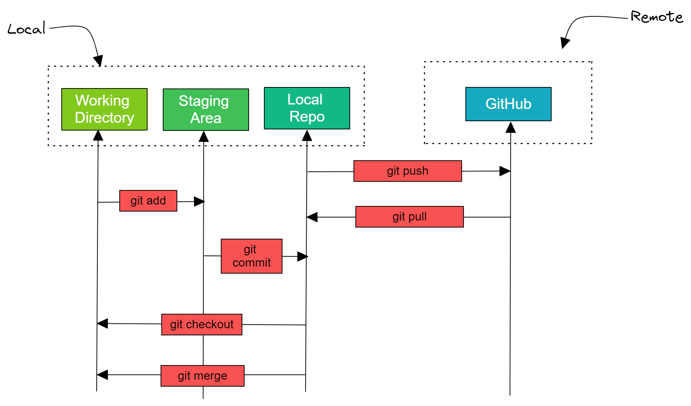

## **Programming Language**

Programming languages are used to write instructions that a computer can understand and execute. These languages provide a way for humans to communicate with computers, allowing the creation of software that performs a wide range of tasks. The use of programming languages is contrasted with machine language, which is the most fundamental level of instruction understood by a computer's hardware.

### Why We Use Programming Languages

1. **Abstraction**: Programming languages provide a higher level of abstraction than machine language. They allow programmers to write instructions in a more human-readable and understandable format, using words and syntax similar to human languages.

2. **Portability**: Code written in a high-level programming language can often be run on different types of computers and operating systems with little or no modification. Machine language, however, is specific to a particular computer's architecture.

3. **Productivity and Efficiency**: Writing code in a high-level language is typically much faster and more efficient. It also allows for more complex operations to be performed with less code.

4. **Error Reduction**: High-level languages have syntax and semantic rules that help in reducing errors. Debugging tools and environments also make it easier to find and fix errors.

5. **Maintainability**: Code in high-level languages is easier to understand, update, and maintain, especially in large projects with multiple developers.
### Machine Language

- **Direct Hardware Control**: Machine language operates directly on the hardware, with no abstraction layer. It consists of binary code (0s and 1s) and is the only language a computer's CPU directly understands.

- **Speed and Efficiency**: Machine language is the fastest in terms of execution speed since it doesn’t need to be translated or interpreted.

- **Hardware-Specific**: It's specific to the architecture of the CPU. A program written in machine language for one type of CPU won’t work on a different CPU.
### Example Comparison

Let's consider a simple task: adding two numbers.

**In a High-Level Language (Python)**:

```python
a = 5
b = 10
c = a + b

print(c)
```

  

**In Machine Language**:

This would be a series of binary digits representing the instruction for addition specific to the CPU's instruction set architecture. It's not human-readable and varies from one CPU to another. But we can do same example in Assembly:

```asm

section .data

a db 5
b db 10
c db 0

section .text
global _start

_start:

; Move values into registers

mov al, [a]

mov bl, [b]

; Add values

add al, bl

; Move result into c

mov [c], al

; Print result

mov eax, 4
mov ebx, 1
mov ecx, c
mov edx, 1
int 0x80

; Exit program
mov eax, 1
xor ebx, ebx
int 0x80

```

### Conclusion

Programming languages are essential for practical and efficient software development. They abstract away the complexities of the machine language, making it easier and more efficient to write, maintain, and run software across various systems. Machine language, while critical as the fundamental layer of computer operation, is impractical for direct use in software development due to its complexity and lack of portability.

Installing Python on Windows is a straightforward process. Here's a step-by-step guide to installing Python on a Windows platform:

## **Install Python**

Python is an excellent language for network engineers due to its simplicity, readability, and vast library support for network-related tasks. Here’s a breakdown of how Python can be leveraged from a network engineer's perspective and an introduction to programming logic.

1. **Automation**:
   - Automate repetitive tasks such as configuration changes, backups, and monitoring.
   - Use libraries like `paramiko` for SSH connections, `netmiko` for simplified device communications, and `napalm` for multi-vendor network automation.

2. **Network Monitoring and Data Collection**:
   - Use SNMP with libraries like pysnmp to collect data from network devices.
   - Use APIs provided by network devices for data collection and configuration management. Python’s requests library is helpful for HTTP API interactions.

3. **Configuration Management**:
   - Automate configuration changes using libraries and tools like netmiko, NAPALM, or Ansible with Python scripts.
   - Generate and push configurations to devices programmatically.

4. **Network Testing**:
   - Use libraries such as scapy for packet crafting and network protocol analysis.
   - Automate testing of network setups and troubleshoot issues with scripts.

5. **Data Analysis**:
   - Collect logs and performance metrics, then analyze them using Python’s data analysis libraries like pandas.
   - Visualize network data using libraries like matplotlib or seaborn.

---

1. **Download Python**

- Go to the official Python website at python.org.
- Hover over the "Downloads" menu, and you should see an option to download Python for Windows. It usually detects your OS and suggests the best version for your system.
- Click on the "Download Python" button.

2. **Run the Installer**

- Once the installer is downloaded, run the executable file to start the installation.
- A dialog will appear. **Important**: Make sure to check the box that says "Add Python x.x to PATH" before you click "Install Now." This will make it easier to run Python from the command line.
- Optionally, you can click on "Customize installation" if you want to select specific parts of Python to install, although the default installation is sufficient for most users.

3. **Wait for the Installation to Complete**

- After clicking "Install Now," the installer will set up Python on your system. This may take a few minutes.
- Once the installation is complete, you may see a screen with a checkbox for "Disable path length limit." It's generally a good idea to enable this to avoid potential issues with the Windows path length limit.

4. **Verify the Installation**

- To check that Python is installed, open the Command Prompt (you can search for 'cmd' in the Start menu).
- Type python --version or python -V and press Enter. You should see the Python version number that you installed.
- To check if pip (Python's package installer) is installed, type pip --version in the Command Prompt and press Enter.

5. **Update pip (Optional but Recommended)**

- It's a good practice to ensure you have the latest version of pip. You can upgrade pip by typing the following command into your Command Prompt:

```
python -m pip install --upgrade pip
```

* This command will download and install the latest version of pip.

After these steps, you should have Python installed and ready to use on your Windows system.
To use Python, you can start the IDLE (Python's Integrated Development and Learning Environment) from the Start menu, or you can write Python scripts in a text editor and run them from the Command Prompt using the `python` command.
### Install virtualenv

`virtualenv` is a tool to create isolated Python environments. This can be very useful when you are working on multiple projects that require different dependencies, versions of Python, etc. Here's how you can install virtualenv and set up a virtual environment on your Windows system:

1. **Open Command Prompt**

First, open your command prompt. You can do this by searching for 'cmd' in the Start menu.

2. **Ensure pip is Installed**

Since virtualenv is installed via pip, you need to ensure pip is installed on your system. Type the following command and hit Enter to check if pip is installed:

```cli
pip --version
```

If pip is installed, you'll see a version number. If it's not, you'll need to install it (though it should come with Python if you've installed Python from python.org).

3. **Install virtualenv**

Type the following command into your Command Prompt to install virtualenv:

```cli
pip install virtualenv
```

This command uses pip to download and install the latest version of virtualenv from the Python Package Index (PyPI).

4. **Create a Virtual Environment**

Once virtualenv is installed, you can create a virtual environment for your project. Navigate to your project directory, or where you'd like to store your environments, using the `cd` command. Then create a new virtual environment with the following command:

```cli
virtualenv myenv
```

Replace myenv with whatever you wish to name your environment. This will create a directory called myenv (or your chosen name) which will contain the Python executable files, and a copy of the pip library which you can use to install other packages.

5. **Activate the Virtual Environment**

To begin using the virtual environment, it needs to be activated:

```cli
myenv\Scripts\activate
```

Once activated, you will notice the command prompt's prompt will change and show the name of your virtual environment, indicating that the environment is active. For example:

```cli
(myenv) C:\Users\YourName\YourProject>
```

6. **Deactivate the Virtual Environment**

When you're done working in the virtual environment for the session, you can deactivate it by simply running:

```cli
deactivate
```

This will revert your command prompt back to the default system settings.
Now you have virtualenv installed and configured, and you can create isolated Python environments for different projects. Each environment can have its own set of packages and can be managed separately without affecting the global Python environment on your system.
### Pip Usage

pip is the package installer for Python and is an essential tool for any developer, including network engineers. It allows you to install and manage additional libraries and dependencies that are not included in the standard Python library. These external libraries can greatly extend the functionality of Python, particularly for network automation and management tasks.

Here's how a network engineer might use pip in their workflow:

**Installation of Network Libraries**

Network engineers can use pip to install libraries that provide functionality for automating network tasks. Some popular libraries include:

- **Netmiko**: A multi-vendor library to simplify Paramiko SSH connections to network devices.
- **NAPALM (Network Automation and Programmability Abstraction Layer with Multivendor support)**: It allows for a unified way to interact with different network device operating systems using Python.
- **PySNMP**: Offers a set of tools for SNMP (Simple Network Management Protocol) operations within Python.
- **Ansible**: Although not exclusively a Python library, it's a powerful automation engine for which `pip` can be used to install various Ansible modules and plugins.
### Command-Line Usage

Here are some common `pip` commands:

- **Installing a package**: `pip install <package-name>`
- **Uninstalling a package**: `pip uninstall <package-name>`
- **Listing installed packages**: `pip list`
- **Showing package information**: `pip show <package-name>`
- **Upgrading a package**: `pip install --upgrade <package-name>`
- **Installing a specific version**: `pip install <package-name>==<version>`
- **Installing packages using a requirements file**: `pip install -r requirements.txt`

## **Notations in Python**

In Python, "notation" generally refers to different conventions or styles used for naming variables, functions, classes, etc. These conventions help improve code readability and maintainability. Some common notations in Python include:

1. **Hungarian Notation**: Prefixing variable names with a tag indicating their data type.
   - Example: str_name, int_age, where str_ indicates a string type and int_ indicates an integer type.

2. **CamelCase**: Words in the variable name are joined without spaces, and each word's initial letter, except the first word, is capitalized.
   - Example: networkDeviceIPAddress, validateDeviceConfiguration

3. **snake_case**: Words in the variable name are separated by underscores, and all letters are lowercase.
   - Example: network_device_ip_address, validate_device_configuration

4. **PascalCase**: Similar to CamelCase, but the first letter of each word, including the first word, is capitalized.
   - Example: NetworkDeviceIPAddress, ValidateDeviceConfiguration

5. **kebab-case**: Words in the variable name are separated by hyphens, and all letters are lowercase.
   - Example: network-device-ip-address, validate-device-configuration

These notations are used to make code more understandable and consistent. In Python, snake_case and CamelCase are the most commonly used conventions, while the others are less prevalent. Choosing the appropriate notation depends on the specific context and the conventions followed by the project or coding environment.

In programming, especially in Python, giving meaningful and clear variable names is an essential skill that significantly enhances code readability, maintainability, and collaboration. As a network engineer and someone working in fields like Cisco VoIP technologies, DevNet, Python, Linux, and Git, you'll benefit greatly from mastering this skill. Let's dive into the art of giving variable names with examples relevant to networking and development.

### Key Principles for Naming Variables

1. **Clarity and Descriptiveness**:
   - The name should clearly describe the variable's purpose or what it represents.
   - Avoid abbreviations unless they are universally understood in your domain.

2. **Consistency**:
   - Stick to a consistent naming convention (e.g., snake_case for variables and functions, PascalCase for classes).
   - Consistent naming conventions make your code predictable and easier to read.

3. **Avoiding Reserved Words**:
   - Do not use Python reserved words (e.g., class, def, return) as variable names.

4. **Meaningful Context**:
   - Provide context so that the variable's role in the code is immediately apparent.
   - In networking, include protocol names, device types, or data types if relevant.

5. **Short but Comprehensive**:
   - Aim for a balance between brevity and descriptiveness.
   - Short enough to be easily readable but comprehensive enough to be clear.

### Examples in a Networking Context

#### Example 1: IP Address Management

**Bad Variable Names**:
```python
a = "192.168.1.1"
b = "192.168.1.2"
```

**Good Variable Names**:
```python
router_ip = "192.168.1.1"
switch_ip = "192.168.1.2"
```

In this example, router_ip and switch_ip clearly indicate that these variables hold the IP addresses of a router and a switch, respectively.

#### Example 2: Network Configuration Parameters

**Bad Variable Names**:
```python
x = "255.255.255.0"
y = "GigabitEthernet0/1"
```

**Good Variable Names**:
```python
subnet_mask = "255.255.255.0"
interface_name = "GigabitEthernet0/1"
```

Here, subnet_mask and interface_name are clear and descriptive, making it obvious what each variable represents.

#### Example 3: Device Status Monitoring

**Bad Variable Names**:
```python
a = True
b = False
```

**Good Variable Names**:
```python
is_router_online = True
is_switch_online = False
```

These names provide context, indicating that the variables represent the online status of a router and a switch.

### Additional Tips

- **Use Singular and Plural Forms Appropriately**:
  - If a variable holds a single item, use a singular noun. If it holds multiple items (e.g., a list or a set), use a plural noun.
  ```python
  device = "Router1"
  devices = ["Router1", "Switch1", "Firewall1"]
  ```

- **Avoid Magic Numbers**:
  - Use descriptive variable names instead of embedding numbers directly in your code.
  ```python
  DEFAULT_PORT = 22
  MAX_CONNECTIONS = 100
  ```

- **Camel Case vs. Snake Case**:
  - Use snake_case for variable names and function names in Python to follow PEP 8 guidelines.
  ```python
  current_user = "admin"
  connect_to_device()
  ```

- **Prefixes and Suffixes**:
  - Use prefixes or suffixes to add context or scope to variable names.
  ```python
  config_file_path = "/etc/network/config"
  error_message = "Connection timed out"
  ```

### Example: Python Script for Network Configuration

```python
# Configuration for Router
router_ip = "192.168.1.1"
router_subnet_mask = "255.255.255.0"
router_interface = "GigabitEthernet0/1"

# Configuration for Switch
switch_ip = "192.168.1.2"
switch_subnet_mask = "255.255.255.0"
switch_interface = "GigabitEthernet0/2"

# Check Device Status
is_router_online = True
is_switch_online = False

# Print Configuration
print(f"Router IP: {router_ip}, Interface: {router_interface}, Online: {is_router_online}")
print(f"Switch IP: {switch_ip}, Interface: {switch_interface}, Online: {is_switch_online}")
```

In this example, variable names are clear and descriptive, making it easy to understand the configuration and status of the network devices.

### Conclusion

Choosing good variable names is an art that combines clarity, consistency, and contextual relevance. As a network engineer, applying these principles to your scripts and programs will make your code more understandable and easier to maintain. Always strive for names that are as descriptive as necessary to convey their purpose without being overly verbose.

##  **Git Usage**

  Ok now we started the writing code, how we store our codes, or share them to someone? let's dive into the world of Git!

**What is Git**

Git is a distributed version control system designed to handle everything from small to very large projects with speed and efficiency. It's like a time machine for your code—it keeps track of every change to every file in a project, so you can revert to older versions or collaborate with others without overwriting each other's work.

**Git Protocol**

In the context of Git, the "protocol" usually refers to the method by which Git repositories are accessed and data is transferred. There are a few different protocols you can use with Git:

1. **HTTP/HTTPS:** The same protocol used for web traffic, it's firewall-friendly and can be secured with SSL/TLS.

2. **SSH:** Secure Shell protocol is a common method for secure logins to remote machines. With Git, it's used for securely transferring repository data.

3. **Git:** This is a special daemon that comes with Git. It listens on a dedicated port (9418) and is a lightweight protocol for transferring data.

Each of these protocols has its own pros and cons regarding speed, security, and setup complexity.  

Here's a small lab  for using the Git protocol on Windows, with a focus on practicing and repeating Git commands:

**Installing Git on Windows**

1. Download the latest version of Git from [git-scm.com](https://git-scm.com/).
2. Run the downloaded `.exe` file and follow the installation instructions.
### Git Configuration

1. Open Git Bash (or use the Windows Command Prompt) and set up your Git user information:

```sh
git config --global user.name "Your Name"
git config --global user.email "your.email@example.com"
git config --global user.name # check username
git config --global user.email # check email
git config --global --list # list config file
git config --global unset user.name # remove user.name
```

**PS :** git config file store in ".gitconfig" 

### Creating a Git Repository

1. Create a new directory:

```sh
mkdir Python_Lab
cd Python_Lab
```

2. Initialize a new Git repository in this directory:

```sh
git init
```

### Adding Files and Committing Changes

1. Create a new file in the repository:

```sh
echo "Hello Git!" > hello.txt
touch script_a.py, script_b.py, script_c.py
```

 but all file untracked 
```shell
git status
On branch master

No commits yet

Untracked files:
  (use "git add <file>..." to include in what will be committed)
        hello_git.txt
        script_a.py,
        script_b.py,
        script_c.py

nothing added to commit but untracked files present (use "git add" to track)

C:\Users\workstation01\Desktop\scripts\git_folder (master)
```

2. Add the file to the staging area:

```shell
C:\Users\workstation01\Desktop\scripts\git_folder (master)
git add hello_git.txt

C:\Users\workstation01\Desktop\scripts\git_folder (master)
git status
On branch master

No commits yet

Changes to be committed:
  (use "git rm --cached <file>..." to unstage)
        new file:   hello_git.txt

Untracked files:
  (use "git add <file>..." to include in what will be committed)
        script_a.py,
        script_b.py,
        script_c.py
```
Now hello_git.txt track but others not. For adding all file you can use "git add ."

3. Commit the file to the repository:

```sh

C:\Users\workstation01\Desktop\scripts\git_folder (master)
git add .

git commit -m "first commit for files"
[master (root-commit) 0380918] first commit for files
 4 files changed, 1 insertion(+)
 create mode 100644 hello_git.txt
 create mode 100644 script_a.py,
 create mode 100644 script_b.py,
 create mode 100644 script_c.py

C:\Users\workstation01\Desktop\scripts\git_folder (master)
```


### Checking Status and Viewing History

1. Check the status of the repository:

```shell
C:\Users\workstation01\Desktop\scripts\git_folder (master)
git status
On branch master
nothing to commit, working tree clean
```

2. View the commit history:

```sh
git log
commit 03809183db43306adbb38bb1e2d493993962bf20 (HEAD -> master)
Author: ilker mansur <saintcisco68@gmail.com>
Date:   Fri May 24 19:02:13 2024 +0300

    first commit for files

C:\Users\workstation01\Desktop\scripts\git_folder (master)
```
### Branching

1. Create a new branch and switch to it:

```sh
C:\Users\workstation01\Desktop\scripts\git_folder (master)
git branch br1

C:\Users\workstation01\Desktop\scripts\git_folder (master)
git checkout br1
Switched to branch 'br1'

C:\Users\workstation01\Desktop\scripts\git_folder (br1)

```

2. You can use both operation with one command 
```shell
C:\Users\workstation01\Desktop\scripts\git_folder (br1)
git switch -c br2 # or git checkout -b br2
Switched to a new branch 'br2'

C:\Users\workstation01\Desktop\scripts\git_folder (br2)

```

**Making Changes on a Branch**

1. Edit hello_git.txt and save some changes.
2. Add the file to the staging area and commit:

```sh
C:\Users\workstation01\Desktop\scripts\git_folder (br1)
git commit -m "hello_git.txt file is edited"
[br1 3f7a8be] hello_git.txt file is edited
 1 file changed, 1 insertion(+)

C:\Users\workstation01\Desktop\scripts\git_folder (br1)
```
There are two hello_git.txt file now

```shell
C:\Users\workstation01\Desktop\scripts\git_folder (br1)

"hello git"
edited by ilker

C:\Users\workstation01\Desktop\scripts\git_folder (br1)
git switch master
Switched to branch 'master'

C:\Users\workstation01\Desktop\scripts\git_folder (master)

"hello git"

C:\Users\workstation01\Desktop\scripts\git_folder (master)
```

### Merging Changes

1. Switch back to the master branch and merge:

```sh 
C:\Users\workstation01\Desktop\scripts\git_folder (master)
git merge br1
Updating 0380918..3f7a8be
Fast-forward
 hello_git.txt | 1 +
 1 file changed, 1 insertion(+)

```
git log give us info about commit

```shell
C:\Users\workstation01\Desktop\scripts\git_folder (master)
git log
commit 3f7a8bef105c75be870d8ff50274172877559db8 (HEAD -> master, br1)
Author: ilker mansur <saintcisco68@gmail.com>
Date:   Fri May 24 19:13:43 2024 +0300

    hello_git.txt file is edited
```
for more info about merging process

```shell
git show 3f7a8bef105c75be870d8ff50274172877559db8
commit 3f7a8bef105c75be870d8ff50274172877559db8 (HEAD -> master, br1)
Author: ilker mansur <saintcisco68@gmail.com>
Date:   Fri May 24 19:13:43 2024 +0300

    hello_git.txt file is edited

diff --git a/hello_git.txt b/hello_git.txt
index 0bbefe6..1774627 100644
--- a/hello_git.txt
+++ b/hello_git.txt
@@ -1 +1,2 @@
 "hello git"
+edited by ilker
```
### Restore Mechanism

In master branch, i edited hello_git.txt file, save it, but do not add git bye git add hello_git.txt command.

```shell
C:\Users\workstation01\Desktop\scripts\git_folder (master)
git status
On branch master

Changes not staged for commit:
  (use "git add <file>..." to update what will be committed)
  (use "git restore <file>..." to discard changes in working directory)
        modified:   hello_git.txt


C:\Users\workstation01\Desktop\scripts\git_folder (master)
git restore hello_git.txt

C:\Users\workstation01\Desktop\scripts\git_folder (master)
git status
On branch master
Changes to be committed:
  (use "git restore --staged <file>..." to unstage)
        modified:   hello_git.txt

```
I restored changes bye using "git restore hello_git.txt"

Again ı did some changes but this time I add to git with "git add hello_git.txt" command. 
```shell

C:\Users\workstation01\Desktop\scripts\git_folder (master)
git add hello_git.txt

C:\Users\workstation01\Desktop\scripts\git_folder (master)
git status
On branch master
Changes to be committed:
  (use "git restore --staged <file>..." to unstage)
        modified:   hello_git.txt


C:\Users\workstation01\Desktop\scripts\git_folder (master)
git restore --stage hello_git.txt
git restore hello_git.txt
```
### Manage Commit

```shell
git log
commit ae84834afb14b6044c09de602a5cbc88ade21a5f (HEAD -> master)
Author: ilker mansur <saintcisco68@gmail.com>
Date:   Fri May 24 20:23:04 2024 +0300

    this is second commit

commit c6507bdcb74ab8983b0936413a404ee5928debb3
Author: ilker mansur <saintcisco68@gmail.com>
Date:   Fri May 24 20:22:00 2024 +0300

    this is first commit

C:\Users\workstation01\Desktop\scripts\hello_git (master)
git checkout c6507bdcb74ab8983b0936413a404ee5928debb3

=== omitted output ===

 

Or undo this operation with:

  git switch -

```
if you want to turm other commit temporary you can should use "git checkout commit SHA". ın this stage 

```shell
git switch -c <new-branch-name> # continue on new branch
git switch -                    # turn from temporary stage
```

```shell
git reset --hard c6507bdcb74ab8983b0936413a404ee5928debb3
HEAD is now at c6507bd this is first commit

C:\Users\workstation01\Desktop\scripts\hello_git (master)

"this is first  line"
```
### Pushing to a Remote Repository (like GitHub)

1. Create a repository on GitHub (or another remote Git service).
2. Add the remote repository (replace `YourUsername` and `YourRepo` with your GitHub username and the new repository name):
```sh
git remote add origin https://github.com/YourUsername/YourRepo.git
```

3. Push the changes to the remote repository:

```sh
git push -u origin master 

```
PS : for authentication there are two option :

1. Github username / password
2. Use generated token :

	Github profile / Settings / Tokens

### Cloning a Remote Repository

1. Clone a remote repository to your local machine (replace the URL with the actual repository URL):

```sh
git clone https://github.com/Username/Repo.git
```

**Fetching and Pulling from Remote**

1. Fetch changes from the remote repository without merging:
```sh
git fetch origin
```
2. Pull changes and merge them into the current branch:
```sh
git pull origin master
```

PS: This guide covers the basics of starting with Git on Windows, including installation, configuration, and common commands for managing files within a repository and syncing with remote repositories. Remember to practice these commands to become more comfortable with Git.

## **Data Types in PYTHON**

Python data types with examples and explanations tailored to a network engineer working on network device automation. Python's data types are foundational for writing scripts that interact with network devices, process data, and automate tasks. Here are the main data types:

### 1. Integers (`int`)

**Description:** Represents whole numbers without a fractional part.

**Example Use Case:** When dealing with network configurations, you might need to specify an interface number or set a timer interval in seconds.

```python
interface_number = 1
interval = 30  # seconds

print(f"Configuring interface GigabitEthernet0/{interface_number}")
print(f"Setting interval to {interval} seconds")
```

Sure, let's dive into some common methods and operations associated with integers in Python and how they can be used in network automation contexts. While integers in Python don't have methods in the same way objects in other languages do, there are several built-in functions and operations that are frequently used with integers.

#### Common Integer Operations

1. **Basic Arithmetic Operations**
2. **Comparison Operations**
3. **Bitwise Operations**
4. **Conversion to Other Types**

#### 1. Basic Arithmetic Operations

**Description:** Operations like addition, subtraction, multiplication, and division are fundamental for manipulating integer values.

**Example Use Case:** Calculating the number of available IP addresses in a subnet or the total bandwidth required.

```python
# Calculate the number of IP addresses in a /24 subnet
subnet_size = 256  # 2^8
reserved_addresses = 2  # Network and Broadcast addresses
usable_addresses = subnet_size - reserved_addresses

print(f"Usable IP addresses in a /24 subnet: {usable_addresses}")

# Calculate total bandwidth required for a link
link_speed_mbps = 100  # Megabits per second
num_links = 4
total_bandwidth = link_speed_mbps * num_links

print(f"Total bandwidth: {total_bandwidth} Mbps")
```

#### 2. Comparison Operations

**Description:** Used to compare two integer values.

**Example Use Case:** Determining if the current load on a device exceeds a threshold.

```python
cpu_load = 85  # in percentage
threshold = 80

if cpu_load > threshold:
    print("CPU load exceeds the threshold!")
else:
    print("CPU load is within acceptable limits.")
```

#### 3. Bitwise Operations

**Description:** Operations that directly manipulate bits of integer values, such as AND, OR, XOR, and bit shifts.

**Example Use Case:** Setting specific flags in a configuration register or manipulating IP addresses in binary form.

```python
# Example of a bitwise AND operation
access_control_register = 0b10101010  # Example binary register
mask = 0b11001100  # Mask to check certain bits

result = access_control_register & mask
print(f"Result of bitwise AND: {bin(result)}")

# Example of a bitwise shift operation
ip_octet = 192  # Example IP address octet
shifted = ip_octet >> 1  # Shift bits to the right by 1

print(f"Original octet: {ip_octet}, Shifted octet: {shifted}")
```

#### 4. Conversion to Other Types

**Description:** Converting integers to other data types, such as strings or binary representations.

**Example Use Case:** Converting an integer to a string for generating configuration commands.

```python
interface_number = 3

# Converting integer to string
interface_name = "GigabitEthernet0/" + str(interface_number)

print(f"Configuring interface: {interface_name}")

# Converting integer to binary representation
ip_octet = 192
binary_representation = bin(ip_octet)

print(f"Binary representation of {ip_octet}: {binary_representation}")
```

### 2. Floating Point Numbers (`float`)

**Description:** Represents numbers with a decimal point.

**Example Use Case:** Useful for precision values like signal strength or bandwidth utilization percentages.

```python
cpu_utilization = 75.5  # percentage

print(f"CPU Utilization is {cpu_utilization}%")
```

### 3. Strings (`str`)

**Description:** Represents sequences of characters, used for text.

**Example Use Case:** Essential for handling IP addresses, device names, and configuration commands.

```python
device_name = "Router1"
ip_address = "192.168.1.1"

print(f"Connecting to device: {device_name} with IP: {ip_address}")
```

Sure, let's explore common methods associated with strings in Python and how they can be used in network automation contexts. Strings are particularly important in network automation for handling commands, device names, IP addresses, and more.

#### Common String Methods

1. **`str.upper()` and `str.lower()`**
2. **`str.strip()`**
3. **`str.replace()`**
4. **`str.split()`**
5. **`str.join()`**
6. **`str.find()`**
7. **`str.format()`**
8. **`str.startswith()` and `str.endswith()`**

#### 1. `str.upper()` and `str.lower()`

**Description:** Convert a string to uppercase or lowercase.

**Example Use Case:** Standardizing device names or commands.

```python
device_name = "Router1"
command = "show version"

print(device_name.upper())  # Output: ROUTER1
print(command.lower())  # Output: show version
```

#### 2. `str.strip()`

**Description:** Remove leading and trailing whitespace.

**Example Use Case:** Cleaning up user input or data retrieved from devices.

```python
raw_input = "  show running-config  "
cleaned_input = raw_input.strip()

print(f"Executing command: '{cleaned_input}'")
# Output: Executing command: 'show running-config'
```

#### 3. `str.replace()`

**Description:** Replace occurrences of a substring with another substring.

**Example Use Case:** Modifying parts of a configuration command or template.

```python
template = "interface GigabitEthernet0/X"
configured_interface = template.replace("X", "1")

print(configured_interface)  # Output: interface GigabitEthernet0/1
```

#### 4. `str.split()`

**Description:** Split a string into a list based on a delimiter.

**Example Use Case:** Parsing command output or configurations.

```python
ip_addresses = "192.168.1.1,192.168.1.2,192.168.1.3"
ip_list = ip_addresses.split(",")

for ip in ip_list:
    print(f"Pinging {ip}")
# Output:
# Pinging 192.168.1.1
# Pinging 192.168.1.2
# Pinging 192.168.1.3
```

#### 5. `str.join()`

**Description:** Join a list of strings into a single string with a specified delimiter.

**Example Use Case:** Creating a single command from multiple parts.

```python
commands = ["show ip interface brief", "show version", "show running-config"]
command_string = " && ".join(commands)

print(command_string)
# Output: show ip interface brief && show version && show running-config
```

#### 6. `str.find()`

**Description:** Find the first occurrence of a substring and return its index, or `-1` if not found.

**Example Use Case:** Checking if a certain keyword or IP address exists in command output.

```python
output = "GigabitEthernet0/0 is up"
keyword = "up"

if output.find(keyword) != -1:
    print("Interface is up")
else:
    print("Interface is down")
```

#### 7. `str.format()`

**Description:** Format a string using placeholders.

**Example Use Case:** Creating dynamic configuration commands or messages.

```python
hostname = "Router1"
ip_address = "192.168.1.1"

message = "Device {hostname} has IP {ip_address}".format(hostname=hostname, ip_address=ip_address)
print(message)
# Output: Device Router1 has IP 192.168.1.1
```

#### 8. `str.startswith()` and `str.endswith()`

**Description:** Check if a string starts or ends with a specific substring.

**Example Use Case:** Filtering commands or device names based on patterns.

```python
interface = "GigabitEthernet0/0"
if interface.startswith("GigabitEthernet"):
    print("Configuring a GigabitEthernet interface")
# Output: Configuring a GigabitEthernet interface
```

### 4. Booleans (`bool`)

**Description:** Represents `True` or `False` values.

**Example Use Case:** Often used in control flow to determine if a condition is met, such as checking if a device is reachable.

```python
device_reachable = True

if device_reachable:
    print("Device is reachable")
else:
    print("Device is not reachable")
```

### 5. Lists (`list`)

**Description:** Ordered collection of items, which can be of mixed types.

**Example Use Case:** Useful for storing lists of IP addresses, interface names, or configuration commands.

```python
ip_addresses = ["192.168.1.1", "192.168.1.2", "192.168.1.3"]
commands = ["show ip interface brief", "show version", "show running-config"]

for ip in ip_addresses:
    print(f"Pinging {ip}")

for command in commands:
    print(f"Executing command: {command}")
```

Certainly! Lists are a fundamental data type in Python that allow you to store and manipulate collections of items. In network automation, lists are particularly useful for handling multiple devices, commands, IP addresses, and more. Let's explore some common list methods and operations with examples relevant to network automation.

#### Common List Methods

1. **`append()`**
2. **`extend()`**
3. **`insert()`**
4. **`remove()`**
5. **`pop()`**
6. **`index()`**
7. **`count()`**
8. **`sort()`**
9. **`reverse()`**
10. **`clear()`**

#### 1. `append()`

**Description:** Adds an element to the end of the list.

**Example Use Case:** Adding new devices to a list of devices to be configured.

```python
devices = ["Router1", "Switch1"]
new_device = "Router2"

devices.append(new_device)
print(devices)  # Output: ['Router1', 'Switch1', 'Router2']
```

#### 2. `extend()`

**Description:** Adds all elements from another list to the end of the current list.

**Example Use Case:** Merging lists of commands or IP addresses.

```python
base_commands = ["show ip interface brief", "show version"]
additional_commands = ["show running-config", "show interfaces"]

base_commands.extend(additional_commands)
print(base_commands)
# Output: ['show ip interface brief', 'show version', 'show running-config', 'show interfaces']
```

#### 3. `insert()`

**Description:** Inserts an element at a specified position in the list.

**Example Use Case:** Inserting a specific command at the beginning of a command list.

```python
commands = ["show version", "show running-config"]
priority_command = "show ip interface brief"

commands.insert(0, priority_command)
print(commands)
# Output: ['show ip interface brief', 'show version', 'show running-config']
```

#### 4. `remove()`

**Description:** Removes the first occurrence of a specified element from the list.

**Example Use Case:** Removing a device from a list after it has been configured.

```python
devices = ["Router1", "Switch1", "Router2"]
configured_device = "Switch1"

devices.remove(configured_device)
print(devices)  # Output: ['Router1', 'Router2']
```

#### 5. `pop()`

**Description:** Removes and returns the element at a specified position. If no index is specified, it removes and returns the last item.

**Example Use Case:** Fetching and removing the next command to be executed.

```python
commands = ["show version", "show running-config", "show interfaces"]
next_command = commands.pop(0)  # Remove and return the first command

print(next_command)  # Output: show version
print(commands)  # Output: ['show running-config', 'show interfaces']
```

#### 6. `index()`

**Description:** Returns the index of the first occurrence of a specified element.

**Example Use Case:** Finding the position of a specific device in a list.

```python
devices = ["Router1", "Switch1", "Router2"]
device_to_find = "Switch1"

index = devices.index(device_to_find)
print(index)  # Output: 1
```

#### 7. `count()`

**Description:** Returns the number of occurrences of a specified element.

**Example Use Case:** Counting how many times a specific command appears in a list.

```python
commands = ["show version", "show running-config", "show version"]
command_to_count = "show version"

count = commands.count(command_to_count)
print(count)  # Output: 2
```

#### 8. `sort()`

**Description:** Sorts the list in ascending order by default. Can be customized with a key and reverse flag.

**Example Use Case:** Sorting a list of IP addresses or device names.

```python
devices = ["Router3", "Router1", "Router2"]
devices.sort()

print(devices)  # Output: ['Router1', 'Router2', 'Router3']
```

#### 9. `reverse()`

**Description:** Reverses the elements of the list in place.

**Example Use Case:** Reversing the order of commands to execute them in the reverse order.

```python
commands = ["show version", "show running-config", "show interfaces"]
commands.reverse()

print(commands)  # Output: ['show interfaces', 'show running-config', 'show version']
```

#### 10. `clear()`

**Description:** Removes all elements from the list.

**Example Use Case:** Clearing a list of commands after they have been executed.

```python
commands = ["show version", "show running-config", "show interfaces"]
commands.clear()

print(commands)  # Output: []
```

### 6. Tuples (`tuple`)

**Description:** Similar to lists but immutable (cannot be changed after creation).

**Example Use Case:** Ideal for storing fixed collections of data, such as interface tuples (interface name, status).

```python
interfaces = [("GigabitEthernet0/0", "up"), ("GigabitEthernet0/1", "down")]

for interface in interfaces:
    print(f"Interface {interface[0]} is {interface[1]}")
```

Certainly! Tuples in Python are similar to lists but are immutable, meaning once they are created, their elements cannot be changed. Tuples are often used to store related pieces of data together, making them useful for situations where a group of values needs to be handled as a single entity. Let's explore some common methods and operations associated with tuples, with examples relevant to network automation.

#### Common Tuple Operations

1. **Accessing Elements**
2. **Unpacking Tuples**
3. **Tuple Concatenation**
4. **Tuple Methods: `count()` and `index()`**
5. **Checking Membership**
6. **Length of a Tuple**

#### 1. Accessing Elements

**Description:** Access elements in a tuple using indexing.

**Example Use Case:** Storing and accessing network device details like name, IP address, and status.

```python
device_info = ("Router1", "192.168.1.1", "up")

device_name = device_info[0]
ip_address = device_info[1]
status = device_info[2]

print(f"Device: {device_name}, IP: {ip_address}, Status: {status}")
# Output: Device: Router1, IP: 192.168.1.1, Status: up
```

#### 2. Unpacking Tuples

**Description:** Assign tuple elements to individual variables in a single step.

**Example Use Case:** Easily extracting multiple related values from a tuple.

```python
device_info = ("Router1", "192.168.1.1", "up")

device_name, ip_address, status = device_info

print(f"Device: {device_name}, IP: {ip_address}, Status: {status}")
# Output: Device: Router1, IP: 192.168.1.1, Status: up
```

#### 3. Tuple Concatenation

**Description:** Combine two or more tuples to create a new tuple.

**Example Use Case:** Merging network configuration data from different sources.

```python
basic_info = ("Router1", "192.168.1.1")
status_info = ("up", "GigabitEthernet0/0")

full_info = basic_info + status_info

print(full_info)
# Output: ('Router1', '192.168.1.1', 'up', 'GigabitEthernet0/0')
```

#### 4. Tuple Methods: `count()` and `index()`

**Description:** `count()` returns the number of times a specified value appears in a tuple, and `index()` returns the index of the first occurrence of a specified value.

**Example Use Case:** Counting occurrences of a status or finding the position of a specific interface.

```python
statuses = ("up", "down", "up", "up", "down")

up_count = statuses.count("up")
first_down_index = statuses.index("down")

print(f"'up' count: {up_count}")
print(f"First 'down' index: {first_down_index}")
# Output:
# 'up' count: 3
# First 'down' index: 1
```

#### 5. Checking Membership

**Description:** Use the `in` keyword to check if an element exists in a tuple.

**Example Use Case:** Verifying if a specific IP address is part of a tuple.

```python
ip_addresses = ("192.168.1.1", "192.168.1.2", "192.168.1.3")

ip_to_check = "192.168.1.2"

if ip_to_check in ip_addresses:
    print(f"IP address {ip_to_check} is in the list.")
else:
    print(f"IP address {ip_to_check} is not in the list.")
# Output: IP address 192.168.1.2 is in the list.
```

#### 6. Length of a Tuple

**Description:** Use the `len()` function to get the number of elements in a tuple.

**Example Use Case:** Determining the number of interfaces configured on a device.

```python
interfaces = ("GigabitEthernet0/0", "GigabitEthernet0/1", "GigabitEthernet0/2")

num_interfaces = len(interfaces)

print(f"Number of interfaces: {num_interfaces}")
# Output: Number of interfaces: 3
```

### 7. Dictionaries (`dict`)

**Description:** Unordered collection of key-value pairs, useful for storing related data.

**Example Use Case:** Perfect for mapping device configurations or storing device information.

```python
device_info = {
    "hostname": "Router1",
    "ip_address": "192.168.1.1",
    "model": "ISR4451-X",
    "interfaces": ["GigabitEthernet0/0", "GigabitEthernet0/1"]
}

print(f"Device {device_info['hostname']} has IP {device_info['ip_address']}")
```

Sure! Dictionaries in Python are a collection of key-value pairs, making them ideal for representing structured data such as device configurations, IP addresses, and other network-related information. Let's explore some common dictionary methods and operations with examples relevant to network automation.

#### Common Dictionary Methods

1. **`dict.get()`**
2. **`dict.keys()`**
3. **`dict.values()`**
4. **`dict.items()`**
5. **`dict.update()`**
6. **`dict.pop()`**
7. **`dict.popitem()`**
8. **`dict.clear()`**

#### 1. `dict.get()`

**Description:** Returns the value for a specified key if the key is in the dictionary. If the key is not found, it returns a default value (None if no default is provided).

**Example Use Case:** Retrieving configuration details for a specific device.

```python
device_configs = {
    "Router1": {"IP": "192.168.1.1", "Status": "up"},
    "Switch1": {"IP": "192.168.1.2", "Status": "down"},
}

router1_config = device_configs.get("Router1")
router2_config = device_configs.get("Router2", "Not found")

print(router1_config)  # Output: {'IP': '192.168.1.1', 'Status': 'up'}
print(router2_config)  # Output: Not found
```

#### 2. `dict.keys()`

**Description:** Returns a view object that displays a list of all the keys in the dictionary.

**Example Use Case:** Listing all devices in the network inventory.

```python
device_configs = {
    "Router1": {"IP": "192.168.1.1", "Status": "up"},
    "Switch1": {"IP": "192.168.1.2", "Status": "down"},
}

device_names = device_configs.keys()
print(device_names)  # Output: dict_keys(['Router1', 'Switch1'])
```

#### 3. `dict.values()`

**Description:** Returns a view object that displays a list of all the values in the dictionary.

**Example Use Case:** Getting all device statuses in the network.

```python
device_configs = {
    "Router1": {"IP": "192.168.1.1", "Status": "up"},
    "Switch1": {"IP": "192.168.1.2", "Status": "down"},
}

device_statuses = [config["Status"] for config in device_configs.values()]
print(device_statuses)  # Output: ['up', 'down']
```

#### 4. `dict.items()`

**Description:** Returns a view object that displays a list of the dictionary's key-value tuple pairs.

**Example Use Case:** Iterating over all devices and their configurations.

```python
device_configs = {
    "Router1": {"IP": "192.168.1.1", "Status": "up"},
    "Switch1": {"IP": "192.168.1.2", "Status": "down"},
}

for device, config in device_configs.items():
    print(f"Device: {device}, Config: {config}")
# Output:
# Device: Router1, Config: {'IP': '192.168.1.1', 'Status': 'up'}
# Device: Switch1, Config: {'IP': '192.168.1.2', 'Status': 'down'}
```

#### 5. `dict.update()`

**Description:** Updates the dictionary with elements from another dictionary or an iterable of key-value pairs.

**Example Use Case:** Updating the configuration of a specific device.

```python
device_configs = {
    "Router1": {"IP": "192.168.1.1", "Status": "up"},
}

new_config = {"Router1": {"IP": "192.168.1.1", "Status": "down"}}
device_configs.update(new_config)

print(device_configs)
# Output: {'Router1': {'IP': '192.168.1.1', 'Status': 'down'}}
```

#### 6. `dict.pop()`

**Description:** Removes the specified key and returns the corresponding value. If the key is not found, it raises a KeyError unless a default value is provided.

**Example Use Case:** Removing a device from the inventory after decommissioning.

```python
device_configs = {
    "Router1": {"IP": "192.168.1.1", "Status": "up"},
    "Switch1": {"IP": "192.168.1.2", "Status": "down"},
}

removed_device = device_configs.pop("Switch1", "Not found")
print(removed_device)  # Output: {'IP': '192.168.1.2', 'Status': 'down'}
print(device_configs)  # Output: {'Router1': {'IP': '192.168.1.1', 'Status': 'up'}}
```

#### 7. `dict.popitem()`

**Description:** Removes and returns the last inserted key-value pair as a tuple. If the dictionary is empty, it raises a KeyError.

**Example Use Case:** Removing the most recently added device configuration.

```python
device_configs = {
    "Router1": {"IP": "192.168.1.1", "Status": "up"},
    "Switch1": {"IP": "192.168.1.2", "Status": "down"},
}

last_added = device_configs.popitem()
print(last_added)  # Output: ('Switch1', {'IP': '192.168.1.2', 'Status': 'down'})
print(device_configs)  # Output: {'Router1': {'IP': '192.168.1.1', 'Status': 'up'}}
```

#### 8. `dict.clear()`

**Description:** Removes all elements from the dictionary.

**Example Use Case:** Clearing the entire network inventory.

```python
device_configs = {
    "Router1": {"IP": "192.168.1.1", "Status": "up"},
    "Switch1": {"IP": "192.168.1.2", "Status": "down"},
}

device_configs.clear()
print(device_configs)  # Output: {}
```

### 8. Sets (`set`)

**Description:** Unordered collection of unique items.

**Example Use Case:** Useful for ensuring unique values, such as unique IP addresses in a subnet.

```python
unique_ips = {"192.168.1.1", "192.168.1.2", "192.168.1.3"}

unique_ips.add("192.168.1.4")  # Adding a new IP
unique_ips.add("192.168.1.1")  # Duplicate IP, won't be added

print(f"Unique IPs: {unique_ips}")
```

Sets in Python are a collection of unique elements, which makes them useful for managing distinct items such as IP addresses, device names, and other network-related data. Sets are unordered, meaning they do not maintain any specific order of elements. Let's explore some common set methods and operations with examples relevant to network automation.

#### Common Set Methods

1. **`add()`**
2. **`update()`**
3. **`remove()`**
4. **`discard()`**
5. **`pop()`**
6. **`clear()`**
7. **`union()`**
8. **`intersection()`**
9. **`difference()`**
10. **`issubset()`**
11. **`issuperset()`**

#### 1. `add()`

**Description:** Adds an element to the set.

**Example Use Case:** Adding a new IP address to a set of monitored IPs.

```python
monitored_ips = {"192.168.1.1", "192.168.1.2"}
new_ip = "192.168.1.3"

monitored_ips.add(new_ip)
print(monitored_ips)  # Output: {'192.168.1.1', '192.168.1.2', '192.168.1.3'}
```

#### 2. `update()`

**Description:** Adds multiple elements (from another set, list, or any iterable) to the set.

**Example Use Case:** Adding multiple new IP addresses to a set of monitored IPs.

```python
monitored_ips = {"192.168.1.1", "192.168.1.2"}
new_ips = {"192.168.1.3", "192.168.1.4"}

monitored_ips.update(new_ips)
print(monitored_ips)  # Output: {'192.168.1.1', '192.168.1.2', '192.168.1.3', '192.168.1.4'}
```

#### 3. `remove()`

**Description:** Removes a specified element from the set. Raises a `KeyError` if the element is not found.

**Example Use Case:** Removing a device from a set of configured devices.

```python
configured_devices = {"Router1", "Switch1", "Router2"}
configured_devices.remove("Switch1")
print(configured_devices)  # Output: {'Router1', 'Router2'}
```

#### 4. `discard()`

**Description:** Removes a specified element from the set if it is present. Does not raise an error if the element is not found.

**Example Use Case:** Removing a device from a set of configured devices safely.

```python
configured_devices = {"Router1", "Switch1", "Router2"}
configured_devices.discard("Switch1")
configured_devices.discard("Switch3")  # No error even though Switch3 is not in the set
print(configured_devices)  # Output: {'Router1', 'Router2'}
```

#### 5. `pop()`

**Description:** Removes and returns an arbitrary element from the set. Raises a `KeyError` if the set is empty.

**Example Use Case:** Removing any IP address from a set for processing.

```python
monitored_ips = {"192.168.1.1", "192.168.1.2", "192.168.1.3"}
ip = monitored_ips.pop()
print(f"Removed IP: {ip}")
print(monitored_ips)  # Output: (one of the IPs will be removed, the rest will remain)
```

#### 6. `clear()`

**Description:** Removes all elements from the set.

**Example Use Case:** Clearing the set of monitored IPs at the end of a monitoring session.

```python
monitored_ips = {"192.168.1.1", "192.168.1.2"}
monitored_ips.clear()
print(monitored_ips)  # Output: set()
```

#### 7. `union()`

**Description:** Returns a new set with elements from the set and all others (union of sets).

**Example Use Case:** Combining sets of IP addresses from different sources.

```python
set1 = {"192.168.1.1", "192.168.1.2"}
set2 = {"192.168.1.3", "192.168.1.4"}

all_ips = set1.union(set2)
print(all_ips)  # Output: {'192.168.1.1', '192.168.1.2', '192.168.1.3', '192.168.1.4'}
```

#### 8. `intersection()`

**Description:** Returns a new set with elements common to the set and all others (intersection of sets).

**Example Use Case:** Finding common IP addresses in different monitoring lists.

```python
set1 = {"192.168.1.1", "192.168.1.2", "192.168.1.3"}
set2 = {"192.168.1.2", "192.168.1.3", "192.168.1.4"}

common_ips = set1.intersection(set2)
print(common_ips)  # Output: {'192.168.1.2', '192.168.1.3'}
```

#### 9. `difference()`

**Description:** Returns a new set with elements in the set that are not in the others (difference of sets).

**Example Use Case:** Finding IP addresses that are in one list but not in another.

```python
set1 = {"192.168.1.1", "192.168.1.2", "192.168.1.3"}
set2 = {"192.168.1.2", "192.168.1.3", "192.168.1.4"}

unique_ips = set1.difference(set2)
print(unique_ips)  # Output: {'192.168.1.1'}
```

#### 10. `issubset()`

**Description:** Returns `True` if the set is a subset of another set.

**Example Use Case:** Checking if a set of IPs is fully contained within another set.

```python
set1 = {"192.168.1.1", "192.168.1.2"}
set2 = {"192.168.1.1", "192.168.1.2", "192.168.1.3"}

is_subset = set1.issubset(set2)
print(is_subset)  # Output: True
```

#### 11. `issuperset()`

**Description:** Returns `True` if the set is a superset of another set.

**Example Use Case:** Checking if a set contains all elements of another set.

```python
set1 = {"192.168.1.1", "192.168.1.2", "192.168.1.3"}
set2 = {"192.168.1.1", "192.168.1.2"}

is_superset = set1.issuperset(set2)
print(is_superset)  # Output: True
```

### 9. NoneType (`None`)

**Description:** Represents the absence of a value.

**Example Use Case:** Often used to initialize variables or to signify that a value is not set.

```python
response = None  # No response initially

# Simulate a function call that might set the response
response = "Success"

if response is not None:
    print(f"Response received: {response}")
else:
    print("No response received")
```

### Practical Example: Automating Network Device Configuration

Here's a small script that demonstrates these data types in the context of automating a network device configuration:

```python
# List of devices to configure
devices = [
    {"hostname": "Router1", "ip_address": "192.168.1.1"},
    {"hostname": "Router2", "ip_address": "192.168.1.2"},
]

# Configuration commands
commands = [
    "interface GigabitEthernet0/0",
    "ip address 10.0.0.1 255.255.255.0",
    "no shutdown"
]

# Function to simulate sending commands to a device
def configure_device(device, commands):
    print(f"Connecting to device {device['hostname']} at {device['ip_address']}")
    for command in commands:
        print(f"Sending command: {command}")

# Iterate over devices and configure each one
for device in devices:
    configure_device(device, commands)
```

In this example, we use dictionaries to store device information, lists to store commands, and a function to simulate the configuration process.

Understanding these data types and how to use them will greatly enhance your ability to write effective Python scripts for network automation.

## **Conditional Statements**

Conditional statements in Python allow you to execute specific blocks of code based on certain conditions. For a network engineer, this can be incredibly useful for making decisions based on network data or device status. Here's a detailed explanation of conditional statements in Python, along with examples relevant to network tasks.

### Conditional Statements Overview

1. **`if` Statement**:
   - Executes a block of code if a specified condition is `True`.
2. **`elif` (else if) Statement**:
   - Checks another condition if the previous `if` or `elif` statement is `False`.
3. **`else` Statement**:
   - Executes a block of code if none of the preceding conditions are `True`.

### Basic Syntax

```python
if condition1:
    # Code to execute if condition1 is True
elif condition2:
    # Code to execute if condition2 is True
else:
    # Code to execute if neither condition1 nor condition2 is True
```

### Example: Checking Interface Status

Let's consider a network task where you want to check the status of interfaces on a router and take action based on their status.

1. **Define the Task**:
   - Check if an interface is up or down.
   - Print a message indicating the status.
   - Perform additional actions if the interface is down.

2. **Sample Data**:
   - A list of dictionaries representing the interface statuses.

### Python Code

```python
# Sample data representing interface statuses
interfaces = [
    {"name": "Gig0/0", "status": "up"},
    {"name": "Gig0/1", "status": "down"},
    {"name": "Gig0/2", "status": "up"},
    {"name": "Gig0/3", "status": "down"},
]

# Iterate over the interfaces and check their status
for interface in interfaces:
    if interface["status"] == "up":
        print(f"Interface {interface['name']} is up.")
    elif interface["status"] == "down":
        print(f"Interface {interface['name']} is down. Taking corrective action.")
        # Example corrective action: log the issue or attempt to bring the interface up
        # This is just a placeholder for the actual action you might take
        corrective_action = f"Attempting to bring {interface['name']} up..."
        print(corrective_action)
    else:
        print(f"Interface {interface['name']} has an unknown status.")
```

### Explanation

- **Data Structure**: The `interfaces` list contains dictionaries, each representing an interface with its `name` and `status`.
- **Iteration**: The `for` loop iterates over each interface in the list.
- **Conditionals**:
  - `if interface["status"] == "up"`: Checks if the interface is up and prints a message.
  - `elif interface["status"] == "down"`: Checks if the interface is down, prints a message, and performs a corrective action.
  - `else`: Handles any unknown status (a catch-all for unexpected cases).

### Conclusion

Conditional statements are fundamental in automating network tasks and making decisions based on network data. By using `if`, `elif`, and `else`, you can write scripts that handle various network scenarios and automate responses to different network conditions. These examples demonstrate how you can use Python to check interface statuses and device reachability, but the same principles can be applied to a wide range of network automation tasks.

## **Loops in Python**

Loops in Python are essential for network engineers as they enable repetitive tasks to be automated, such as iterating over a list of devices to perform configurations, collect data, or troubleshoot network issues. Let's explore loops in Python and provide a network task example to illustrate their usage.

### Loops Overview

1. **`for` Loop**:
   - Executes a block of code a specified number of times, iterating over an iterable object (e.g., lists, tuples, dictionaries).

2. **`while` Loop**:
   - Executes a block of code as long as a specified condition is `True`.

### `for` Loop Syntax

```python
for item in iterable:
    # Code block to execute for each item
```

### `while` Loop Syntax

```python
while condition:
    # Code block to execute as long as condition is True
```

### Example: Configuring Multiple Devices

Let's consider a common network task where you need to configure multiple network devices with the same set of parameters.

1. **Define the Task**:
   - Configure VLAN 100 on a list of switches.

2. **Sample Data**:
   - A list of switch IP addresses.

### Python Code

```python
import netmiko

# List of switch IP addresses
switches = ["192.168.1.1", "192.168.1.2", "192.168.1.3"]

# Configuration commands
vlan_config = [
    "vlan 100",
    "name Data_VLAN",
    "exit"
]

# Iterate over the switches and configure VLAN 100
for switch in switches:
    # Establish SSH connection to the switch
    connection = netmiko.ConnectHandler(
        device_type='cisco_ios',
        host=switch,
        username='admin',
        password='password'
    )

    # Send configuration commands
    output = connection.send_config_set(vlan_config)
    
    print(f"Configured VLAN 100 on switch {switch}")
    print("Output:", output)
    
    # Close the connection
    connection.disconnect()
```

### Explanation

- **Data Structure**: The `switches` list contains IP addresses of switches.
- **Iteration**: The `for` loop iterates over each switch in the list.
- **SSH Connection**: Inside the loop, an SSH connection is established to each switch using `netmiko`.
- **Configuration Commands**: The `vlan_config` list contains commands to configure VLAN 100.
- **Configuration**: The `send_config_set` method sends the configuration commands to each switch.
- **Output**: The output of the configuration commands is printed.
- **Connection Close**: Finally, the SSH connection is closed.

### Example: Polling Network Devices

Another example is polling network devices to collect data at regular intervals.

```python
import time
import netmiko

devices = ["192.168.1.1", "192.168.1.2", "192.168.1.3"]

while True:
    for device in devices:
        connection = netmiko.ConnectHandler(
            device_type='cisco_ios',
            host=device,
            username='admin',
            password='password'
        )

        output = connection.send_command("show interface status")
        print(f"Device: {device}")
        print(output)
        
        connection.disconnect()
    
    time.sleep(300)  # Sleep for 5 minutes before polling again
```

- In this example, a `while` loop is used to continuously poll the devices every 5 minutes (`time.sleep(300)`).
- Inside the loop, a `for` loop iterates over each device in the `devices` list.
- An SSH connection is established to each device, and the `show interface status` command is sent to collect data.

### Conclusion

Loops are indispensable for network engineers when automating repetitive tasks such as configuration management, data collection, and device monitoring. By leveraging loops in Python, network engineers can efficiently manage and monitor network infrastructure, saving time and reducing the likelihood of errors.

## **Functions in Python**

Functions in Python are crucial for network engineers as they allow for the organization and reuse of code, making it easier to automate repetitive tasks, manage configurations, and perform network operations. Let's delve into functions in Python and provide a network task example to demonstrate their utility.

### Functions Overview

1. **Function Definition**:
   - A block of reusable code that performs a specific task.
   - Functions are defined using the `def` keyword followed by the function name and parameters.

2. **Function Call**:
   - To execute a function, you call it by its name and pass any required arguments.

3. **Return Statement**:
   - Functions can return data back to the caller using the `return` statement.

### Function Syntax

```python
def function_name(parameters):
    # Function body
    # Perform tasks using parameters
    return result  # Optional
```

### Example: Configuring Interfaces Function

Let's consider a network task where you frequently need to configure interfaces on routers. You can create a function to streamline this process.

1. **Define the Task**:
   - Configure an interface with an IP address and description.

### Python Code

```python
import netmiko

def configure_interface(device_ip, interface, ip_address, description):
    # Establish SSH connection to the device
    connection = netmiko.ConnectHandler(
        device_type='cisco_ios',
        host=device_ip,
        username='admin',
        password='password'
    )
    
    # Generate configuration commands
    config_commands = [
        f"interface {interface}",
        f"ip address {ip_address}",
        f"description {description}",
        "no shutdown",
        "exit"
    ]
    
    # Send configuration commands
    output = connection.send_config_set(config_commands)
    
    # Close the connection
    connection.disconnect()
    
    return output

# Example usage of the function
interface_output = configure_interface("192.168.1.1", "GigabitEthernet0/0", "192.168.1.1 255.255.255.0", "LAN Interface")
print("Configuration Output:", interface_output)
```

### Explanation

- **Function Definition**: The `configure_interface` function takes device IP, interface name, IP address, and description as parameters.
- **SSH Connection**: Inside the function, an SSH connection is established to the specified device using `netmiko`.
- **Configuration Commands**: Configuration commands are generated based on the provided parameters.
- **Sending Configuration**: The generated commands are sent to the device using `send_config_set`.
- **Return Output**: The output of the configuration commands is returned back to the caller.
- **Function Call**: The function is called with sample parameters to configure a specific interface.

### Conclusion

Functions are invaluable for network engineers, enabling them to encapsulate reusable code, simplify complex tasks, and enhance code readability. By defining functions for common network operations, engineers can automate tasks more efficiently, streamline configuration management, and maintain cleaner and more modular codebases.

## **Args and kwargs in Python**

In Python, `*args` and `**kwargs` are special syntax used in function definitions to handle variable numbers of arguments. These can be particularly useful for network engineers when dealing with functions that need to accept a flexible number of parameters, such as when configuring multiple devices with different settings. Let's explore `*args` and `**kwargs` in Python and provide a network task example to illustrate their usage.

### `*args` and `**kwargs` Overview

1. **`*args`**:
   - Used to pass a variable number of non-keyword arguments to a function.
   - `*args` collects these arguments into a tuple.

2. **`**kwargs`**:
   - Used to pass a variable number of keyword arguments to a function.
   - `**kwargs` collects these arguments into a dictionary.

let's  example to better illustrate `*args` and `**kwargs`:

```python
def example_function(arg1, *args, **kwargs):
    print("Regular argument:", arg1)
    print("Additional non-keyword arguments (args):", args)
    print("Additional keyword arguments (kwargs):", kwargs)

# Example usage of the function
example_function("Hello", "World", 123, key1="value1", key2="value2")
```

### Output:

```
Regular argument: Hello
Additional non-keyword arguments (args): ('World', 123)
Additional keyword arguments (kwargs): {'key1': 'value1', 'key2': 'value2'}
```

### Explanation:

- The function `example_function` accepts a regular argument `arg1`, followed by `*args` to collect any additional non-keyword arguments and `**kwargs` to collect any additional keyword arguments.
- When calling the function, `"Hello"` is passed as the value for `arg1`. Additional non-keyword arguments `"World"` and `123` are collected into the `args` tuple. Additional keyword arguments `key1="value1"` and `key2="value2"` are collected into the `kwargs` dictionary.
- Inside the function, we print out the values of `arg1`, `args`, and `kwargs` to see how the arguments are collected.

This simple example demonstrates how `*args` collects additional positional arguments into a tuple and `**kwargs` collects additional keyword arguments into a dictionary, allowing for flexible function parameter handling.

### Conclusion

`*args` and `**kwargs` are powerful features in Python that allow functions to accept a variable number of arguments, making them versatile and flexible. In the context of network engineering, these features can be used to create functions that can handle different configurations, settings, or operations across multiple devices in a concise and efficient manner.

## **Libraries in Python**

Libraries in Python are collections of pre-written code that provide functionalities to accomplish specific tasks. For network engineers, libraries play a crucial role in simplifying the development of network automation scripts, managing network configurations, monitoring network devices, and analyzing network data. Let's explore libraries in Python and provide a network task example to illustrate their usage.

### Libraries Overview

1. **Standard Libraries**:
   - These are part of the Python Standard Library and come bundled with Python installation. They provide basic functionalities for various tasks.

2. **Third-Party Libraries**:
   - These are developed by third-party developers and provide additional functionalities beyond the standard library. They cover a wide range of domains, including networking.

### Common Libraries for Network Engineers

1. **`netmiko`**: A multi-vendor library to simplify SSH connections to network devices and execute commands.
2. **`paramiko`**: A Python implementation of SSHv2 for secure connections and file transfers.
3. **`requests`**: A powerful HTTP library for making HTTP requests, commonly used for interacting with REST APIs on network devices.
4. **`pandas`**: A data manipulation and analysis library often used for handling and analyzing network data.

###  `netmiko` 

Let's consider a network task where you need to connect to multiple network devices and retrieve their configurations using SSH. We'll use the `netmiko` library to simplify this process.

1. **Define the Task**:
   - Connect to multiple switches and routers via SSH.
   - Retrieve the running configurations of each device.

#### Python Code

```python
from netmiko import ConnectHandler

# List of device IP addresses
devices = [
    {
        "device_type": "cisco_ios",
        "host": "192.168.1.1",
        "username": "admin",
        "password": "password"
    },
    {
        "device_type": "cisco_ios",
        "host": "192.168.1.2",
        "username": "admin",
        "password": "password"
    }
]

# Function to retrieve running configuration
def get_running_config(device):
    connection = ConnectHandler(**device)
    config_output = connection.send_command("show running-config")
    connection.disconnect()
    return config_output

# Iterate over devices and retrieve configurations
for device in devices:
    config = get_running_config(device)
    print(f"Running configuration for {device['host']}:")
    print(config)
    print("="*50)
```

#### Explanation

- **`netmiko` Import**: We import the `ConnectHandler` class from the `netmiko` library, which provides SSH connectivity to network devices.
- **Device List**: We define a list of dictionaries, where each dictionary contains connection details for a network device (IP address, username, password, device type).
- **Function Definition**: We define a function `get_running_config` to retrieve the running configuration of a device using SSH.
- **SSH Connection**: Inside the function, we establish an SSH connection to the device using `ConnectHandler` and retrieve the running configuration using `send_command`.
- **Iteration**: We iterate over the devices, call the `get_running_config` function for each device, and print the running configuration.

### `Pandas` 

Pandas is a powerful data manipulation and analysis library in Python that provides easy-to-use data structures and functions to work with structured data, such as tables and time series data. For network engineers, Pandas can be incredibly useful for handling network data, analyzing network performance metrics, and generating reports. Let's explore Pandas from a network engineer's perspective and provide a network task example to illustrate its usage.

#### Pandas Overview

1. **Data Structures**:
    
- Pandas provides two primary data structures: Series and DataFrame.
- Series represents a one-dimensional array, similar to a column in a spreadsheet.
- DataFrame is a two-dimensional labeled data structure with columns of potentially different types, resembling a spreadsheet or SQL table.

2. **Data Manipulation**:

- Pandas offers a wide range of functions for data manipulation, including indexing, slicing, filtering, merging, grouping, and aggregation.

3. **Data Analysis**:

- Pandas enables descriptive and exploratory data analysis, statistical analysis, data visualization, and time series analysis.

Certainly! Let's extend the example to demonstrate how to use specific columns from the Excel and CSV files to perform network device configuration tasks.

#### Example: Configuring Network Devices Using Data from Files

We'll continue with the scenario where you have information about routers in an Excel file and information about switches in a CSV file. We'll use specific columns from these files to configure network devices.

1. **Define the Task**:
   - Read specific columns from Excel and CSV files containing network device information.
   - Use this information to configure network devices.

#### Python Code

```python
import pandas as pd

# Read specific columns from Excel file
router_df = pd.read_excel("routers.xlsx", usecols=["Hostname", "IP Address", "Username", "Password"])

# Read specific columns from CSV file
switch_df = pd.read_csv("switches.csv", usecols=["Device Name", "IP Address", "Username", "Password"])

# Function to configure network device
def configure_device(hostname, ip_address, username, password):
    print(f"Configuring device {hostname} with IP address {ip_address} using credentials {username}/{password}")
    # Add logic to configure the network device

# Configure routers
print("Configuring Routers:")
for index, row in router_df.iterrows():
    configure_device(row["Hostname"], row["IP Address"], row["Username"], row["Password"])

# Configure switches
print("\nConfiguring Switches:")
for index, row in switch_df.iterrows():
    configure_device(row["Device Name"], row["IP Address"], row["Username"], row["Password"])
```

#### Explanation

- We use the `usecols` parameter of `pd.read_excel()` and `pd.read_csv()` functions to read specific columns from the Excel and CSV files, respectively.
- We define a `configure_device` function that takes hostname, IP address, username, and password as parameters and prints a message indicating the configuration action.
- We iterate over rows of the DataFrames using `iterrows()` and call the `configure_device` function for each row, passing the required information.

#### Additional Considerations

- In a real-world scenario, you would replace the print statement in the `configure_device` function with actual configuration logic using libraries like Netmiko or Paramiko to establish SSH connections and send configuration commands to the devices.
- Ensure that the columns specified in the `usecols` parameter correspond to the columns containing the required information in the Excel and CSV files.

#### Conclusion

By leveraging Pandas to read specific columns from Excel and CSV files, network engineers can easily extract relevant information for configuring network devices. This approach simplifies the process of handling network device configurations and enables efficient automation of network management tasks.

### `json`

The `json` library in Python provides functionalities to work with JSON (JavaScript Object Notation) data, which is commonly used for storing and exchanging data over the network. For network engineers, the `json` library is essential for parsing JSON data received from network devices, interacting with REST APIs, and exchanging structured data in a human-readable format. Let's explore the `json` library from a network engineer's perspective and provide a network task example to illustrate its usage.

#### JSON Library Overview

1. **Serialization and Deserialization**:
   - `json.dumps()`: Serialize Python objects to a JSON formatted string.
   - `json.loads()`: Deserialize a JSON formatted string to Python objects.

2. **File I/O**:
   - `json.dump()`: Write Python objects to a JSON file.
   - `json.load()`: Read data from a JSON file and parse it into Python objects.

#### Example: Parsing JSON Data from a Network Device

Let's consider a network task where you need to retrieve device information from a network device via its REST API, which returns data in JSON format. We'll use the `requests` library to make the API request and the `json` library to parse the JSON response.

1. **Define the Task**:
   - Retrieve device information from a network device via its REST API.
   - Parse the JSON response to extract relevant information.

#### Python Code

```python
import requests
import json

# Example API endpoint for retrieving device information
api_endpoint = "https://example.com/api/device_info"

# Make API request to retrieve device information
response = requests.get(api_endpoint)

# Check if request was successful
if response.status_code == 200:
    # Parse JSON response
    device_info = response.json()
    
    # Display device information
    print("Device Information:")
    print(json.dumps(device_info, indent=4))  # Pretty print JSON data
    
    # Extract specific information
    hostname = device_info["hostname"]
    model = device_info["model"]
    serial_number = device_info["serial_number"]
    
    print("\nHostname:", hostname)
    print("Model:", model)
    print("Serial Number:", serial_number)
else:
    print("Failed to retrieve device information. Status code:", response.status_code)
```

#### Explanation

- We use the `requests.get()` function to make an HTTP GET request to the API endpoint.
- We check if the request was successful (status code 200) before proceeding.
- We use the `response.json()` method to parse the JSON response into a Python dictionary.
- We display the device information using `json.dumps()` with an indent to print the JSON data in a readable format.
- We extract specific information from the parsed JSON data and display it.

#### Conclusion

The `json` library in Python facilitates the parsing and manipulation of JSON data, which is commonly used in network programming for interacting with network devices, REST APIs, and exchanging structured data. By mastering the `json` library, network engineers can efficiently handle JSON data, extract relevant information, and automate network management tasks.

### `file`

In Python, working with files is essential for network engineers when dealing with configuration files, log files, data backups, and exchanging information between network devices and servers. Let's explore file handling in Python from a network engineer's perspective and provide a network task example to illustrate its usage.

#### File Handling Overview

1. **Opening and Closing Files**:
   - Use the `open()` function to open a file and specify the mode (read, write, append, etc.).
   - Always close the file using the `close()` method to release system resources.

2. **Reading from Files**:
   - Use methods like `read()`, `readline()`, or `readlines()` to read data from a file.

3. **Writing to Files**:
   - Use methods like `write()` or `writelines()` to write data to a file.

#### Example: Logging Network Device Information

Let's consider a network task where you need to log information about network devices to a file, such as device hostname, IP address, and model. We'll create a simple log file containing this information.

1. **Define the Task**:
   - Log network device information to a file for record-keeping or troubleshooting purposes.

#### Python Code

```python
# Sample network device information
devices = [
    {"hostname": "router1", "ip_address": "192.168.1.1", "model": "Cisco ISR 2900"},
    {"hostname": "switch1", "ip_address": "192.168.1.2", "model": "Cisco Catalyst 2960"},
    # Add more device information...
]

# Define the log file name
log_file = "device_info.log"

# Open the log file in append mode
with open(log_file, "a") as file:
    # Write device information to the log file
    for device in devices:
        file.write(f"Hostname: {device['hostname']}, IP Address: {device['ip_address']}, Model: {device['model']}\n")

print("Device information logged successfully.")
```

#### Explanation

- We define a list of dictionaries `devices`, where each dictionary represents information about a network device.
- We specify the name of the log file `device_info.log`.
- We open the log file in append mode using a `with` statement, which ensures that the file is properly closed after writing.
- We iterate over the `devices` list and write device information to the log file using the `write()` method.
- Each line in the log file contains information about a single device.

#### Additional Considerations

- For larger files or frequent file operations, consider using buffered I/O for better performance.
- When working with sensitive information like passwords, ensure proper security measures are in place, such as encryption or restricted access permissions.

#### Conclusion

File handling in Python provides network engineers with the capability to store, retrieve, and manipulate data stored on disk. Whether it's logging network device information, reading configuration files, or analyzing log files, mastering file handling techniques is crucial for efficient network management and troubleshooting.

### `requests`

The `requests` library in Python is a powerful tool for making HTTP requests, which is incredibly useful for network engineers working with APIs, web services, and other network-related tasks. Let's explore it with a network task example, both with and without using a class.


```python
import requests

# Example: Retrieve information from a REST API
def get_device_info(ip_address):
    url = f"http://{ip_address}/api/device/info"
    response = requests.get(url)
    
    if response.status_code == 200:
        device_info = response.json()
        return device_info
    else:
        print(f"Failed to retrieve device info. Status code: {response.status_code}")

# Usage example
device_ip = "192.168.1.100"
device_info = get_device_info(device_ip)
if device_info:
    print("Device Info:")
    print(device_info)
```

The `requests` library in Python provides several parameters that you can use to customize your HTTP requests. While none of these parameters are mandatory for making a basic request, some are commonly used to specify headers, query parameters, request body, and more. Here are some of the most commonly used parameters:

1. `url` (mandatory): The URL of the resource you want to request.
2. `params`: A dictionary or bytes to be sent in the query string of the request URL.
3. `data`: A dictionary, bytes, or file-like object to send in the body of the request.
4. `json`: A JSON serializable object to send in the body of the request. This will override `data`.
5. `headers`: A dictionary of HTTP headers to send with the request.
6. `cookies`: A dictionary or CookieJar object to send with the request.
7. `files`: A dictionary of file-like objects for multipart encoding upload.
8. `auth`: A tuple of HTTP Basic Auth username and password.
9. `timeout`: The maximum amount of time (in seconds) to wait for a response from the server.
10. `allow_redirects`: A boolean indicating whether redirects should be followed automatically.
11. `proxies`: A dictionary mapping protocol or protocol and hostname to the URL of the proxy.
12. `verify`: A boolean or string indicating whether SSL certificate verification should be performed.
13. `stream`: A boolean indicating whether to immediately download the response content.
14. `cert`: A tuple containing SSL certificate and private key files.

You can find the full list of parameters and their details in the `requests` library documentation. To know which parameters are mandatory for a specific request, you typically need to refer to the documentation of the API or service you're interacting with. Usually, APIs will specify the required parameters and their formats in their documentation.

For example, if you're working with the GitHub API to create a new repository, the documentation would specify which parameters are mandatory (e.g., `name` for the repository name) and any other optional parameters you can include (e.g., `description`, `private`, etc.).
### Conclusion

Libraries in Python provide a wealth of functionalities that empower network engineers to automate tasks, manage configurations, monitor network devices, and analyze network data with ease. By leveraging the right libraries, network engineers can streamline their workflows, improve productivity, and enhance the efficiency and reliability of network operations.

## **Class in Python**

In Python, a class is a blueprint for creating objects that have attributes (variables) and methods (functions). Classes are fundamental for organizing and modeling real-world entities, and they play a crucial role in network engineering for encapsulating network devices, configurations, and operations. Let's explore classes in Python and provide a network task example both with and without using a class.

### Classes Overview

1. **Class Definition**:
   - A class is defined using the `class` keyword, followed by the class name.
   - Inside a class, you define attributes and methods that describe the properties and behaviors of objects created from that class.

2. **Object (Instance)**:
   - An object is an instance of a class. It represents a specific instance of the class with its unique attributes and methods.

### Example: Network Device Management

Let's consider a network task where you need to manage multiple network devices, such as routers and switches. We'll create a simplified example to illustrate how classes can be used to model network devices.

### Without Using Class

```python
# Without using class
devices = [
    {"type": "router", "ip": "192.168.1.1", "username": "admin", "password": "password"},
    {"type": "switch", "ip": "192.168.1.2", "username": "admin", "password": "password"}
]

def configure_device(device):
    # Logic to configure the device
    print(f"Configuring {device['type']} with IP address {device['ip']}")

# Example usage
for device in devices:
    configure_device(device)
```

### Explanation

- In this approach, we represent each network device as a dictionary with attributes like type, IP address, username, and password.
- We define a function `configure_device` to perform configuration tasks based on the device dictionary passed to it.
- We iterate over the list of devices and call the `configure_device` function for each device.

### Using Class

```python
class NetworkDevice:
    def __init__(self, device_type, ip, username, password):
        self.device_type = device_type
        self.ip = ip
        self.username = username
        self.password = password
    
    def configure(self):
        # Logic to configure the device
        print(f"Configuring {self.device_type} with IP address {self.ip}")

# Example usage
devices = [
    NetworkDevice("router", "192.168.1.1", "admin", "password"),
    NetworkDevice("switch", "192.168.1.2", "admin", "password")
]

for device in devices:
    device.configure()
```

### Explanation

- We define a `NetworkDevice` class with attributes (`device_type`, `ip`, `username`, `password`) and a method `configure`.
- The `__init__` method is a special method called the constructor, which initializes the object with the provided attributes.
- The `configure` method performs configuration tasks specific to the device.
- We create instances of the `NetworkDevice` class for each network device, passing attributes during instantiation.
- We call the `configure` method for each device object to perform configuration tasks.

### Conclusion

Using classes in Python allows network engineers to model and manage network entities more effectively by encapsulating related attributes and behaviors within objects. Classes provide a clean and structured approach to organizing code, promoting code reusability, and simplifying complex tasks in network automation, configuration management, and monitoring.


