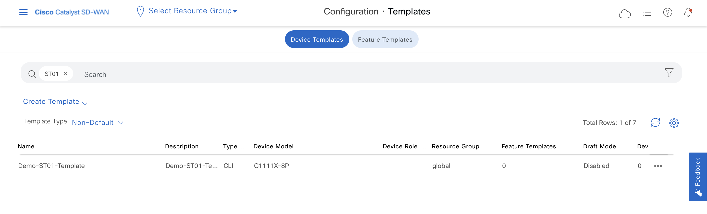

## **SD-WAN with Python**

Cisco SD-WAN (Software-Defined Wide Area Network) is a solution that simplifies the management and operation of a WAN by decoupling the networking hardware from its control mechanism. Using Python, you can interact with Cisco SD-WAN APIs to automate and manage various network tasks. Here’s a detailed explanation with examples, focusing on the perspective of a network engineer.

### Overview of Cisco SD-WAN and Python Interaction

1. **Cisco SD-WAN Components**:
- **vManage**: The centralized management controller that provides a GUI and REST APIs for configuration and management.
- **vBond**: Facilitates the initial orchestration and connection between the SD-WAN components.
- **vSmart**: The controller that manages policies and control plane traffic.
- **Edge Routers**: The physical or virtual devices that provide secure data plane connectivity.

2. **Python and REST APIs**:
- Cisco SD-WAN exposes RESTful APIs through the vManage platform.
- Using Python, you can interact with these APIs to perform various network operations like monitoring, configuration, policy management, and troubleshooting.

### Setting Up the Environment

To start with, ensure you have the following:
- Access to a Cisco SD-WAN environment with vManage.
- Python installed on your machine.
- Required Python libraries: `requests` and optionally `json` for handling API requests and responses.

### Example: Fetching Device Information

Here’s an example of how to use Python to fetch device information from Cisco SD-WAN vManage.

#### Step-by-Step Guide

1. **Install Required Libraries**:
```bash
pip install requests
```

2. **Python Script to Interact with vManage API**:

```python
import requests
import json

# Variables
vmanage_ip = 'YOUR_VMANAGE_IP'
username = 'YOUR_USERNAME'
password = 'YOUR_PASSWORD'
login_url = f'https://{vmanage_ip}/j_security_check'
device_url = f'https://{vmanage_ip}/dataservice/device'

# Disable warnings about SSL (optional)
requests.packages.urllib3.disable_warnings()

# Function to authenticate
def authenticate(vmanage_ip, username, password):
    headers = {'Content-Type': 'application/x-www-form-urlencoded'}
    payload = {'j_username': username, 'j_password': password}
    session = requests.session()
    response = session.post(login_url, headers=headers, data=payload, verify=False)
    if response.status_code == 200:
        print("Authentication successful!")
        return session
    else:
        print("Authentication failed!")
        exit()

# Function to get device information
def get_devices(session):
    response = session.get(device_url, verify=False)
    if response.status_code == 200:
        devices = response.json()['data']
        return devices
    else:
        print("Failed to get device information")
        exit()


session = authenticate(vmanage_ip, username, password)
devices = get_devices(session)

print(json.dumps(devices, indent=2))
```

#### Explanation

- **Authentication**:
  - We define a function `authenticate()` to handle the login to vManage using the `/j_security_check` endpoint.
  - This function takes the vManage IP, username, and password, and returns a session object if the login is successful.

- **Fetching Device Information**:
  - We define a function `get_devices()` to retrieve the list of devices from the `/dataservice/device` endpoint.
  - This function uses the authenticated session to make a GET request and fetch the device data in JSON format.

- **Main Script Execution**:
  - The script authenticates to the vManage API and retrieves the device information.
  - The device information is then printed in a formatted JSON structure for easy reading.

### Use Cases

1. **Automating Network Configuration**:
   - Use Python scripts to push configuration changes to multiple devices simultaneously, ensuring consistency and reducing manual errors.

2. **Monitoring and Reporting**:
   - Schedule Python scripts to periodically fetch device status, interface statistics, and performance metrics, and generate reports.

3. **Policy Management**:
   - Automate the creation and deployment of security and traffic policies across the network using Python scripts.

4. **Troubleshooting and Diagnostics**:
   - Quickly gather diagnostic information (logs, device status) from multiple devices to expedite troubleshooting processes.

### Getting Alarms

Some SDWAN automation cases, there is mandatory item, in this example `query`.
Each query consists of four sections:

Size—Number of statistics records to retrieve.
Query—Input values for the statistics database query.
Sort—Output field to sort the results by and sorting order.
Fields—Statistics data fields to include in the query output.  

```python
import requests
import json
from get_login import authenticate

vmanage_ip = '192.168.71.80'

# Getting session from `get_login.py`
session = authenticate()

query = {
	"size": 100, # Return 100 records
	"query": {
		"condition": "OR", # Records must match all rules; there are three:
		"rules": [
				{
				"value": [
				"24" # Rule #1: Records from the last 24 hours
					],
				"field": "entry_time",
				"type": "date",
				"operator": "last_n_hours"
				},
				{
				"value": [
				"critical" # Rule #2: Severity level = critical
					],
				"field": "severity_level",
				"type": "string",
				"operator": "in"
				},
				{
				"value": [
				"security" # <== Rule #3: Event type = security
					],
				"field": "component",
				"type": "string",
				"operator": "in"
				}
			]
		}
	}
# === get devices ===

api_alarms = f'/dataservice/alarms?query={json.dumps(pre_payload)}'
base_url = f"https://{vmanage_ip}:443"

def get_alarms():
        response = session.get(url=base_url+api_alarms,verify=False)
        if response.status_code == 200:
            list_data = list(response.json()['data'])
            for alarm in list_data :
                print ('=' * 100)
                print (json.dumps(alarm, indent=4))
        else:
            print (f'error is occured : {response.status_code}')
            print (response.content)

get_alarms()
```

### Get Info About Fabric 

With some easy request, you can `PULL` rich  info about SDWAN topology. URL format :
URL Format = /dataservice/data/device/state/data_type?count=number_of_query

**Some of Data Types :**

BFDSessions	            
BGPNeighbor	            
Bridge	                         
ControlConnection	    
ControlLocalProperty	
ControlWanInterface	    
HardwareAlarms	        
HardwareEnvironment	    
HardwareInventory
Interface	     
OMPPeer	                
SystemStatus	       
System

```python
vmanage_ip = '192.168.71.80'
api_info = '/dataservice/data/device/state/System'
base_url = f"https://{vmanage_ip}:443"

# === get interface info ===

def get_info():
    session = authenticate()
    url_device = f'https://{vmanage_ip}:443{api_info}'

    response = session.get(url=url_device,verify=False)
    if response.status_code == 200:
       json_data = response.json()
       for item in json_data['data']:
           print (item)

    else:
        print (f'error is occured : {response.status_code}')
        print (response.content)

get_info()
```

### Get Realtime Info

Realtime and statistics are very important for monitoring SDWAN Fabric. You can observe lots of data from this api, that full list is below:

[Full-List](https://developer.cisco.com/docs/sdwan/device-realtime-monitoring/#realtime-monitoring-api-endpoints)

```python
import requests
from a_get_login import authenticate
import json

vmanage_ip = '192.168.71.80'
device_id = '100.255.34.1'
api_int_info = f'/dataservice/device/interface?deviceId={device_id}'
session = authenticate()

# === get interface info ===

def get_devices():
    
    url_device = f'https://{vmanage_ip}:443{api_int_info}'

    response = session.get(url=url_device,verify=False)
    if response.status_code == 200:
        print ("Get Devices Success")
        data = response.json()
        print(data['data'][0])
   
    else:
        print (f"Get Devices Failed : {response.content}")


get_devices()

"""
{
  "vdevice-name": "100.255.34.1",
  "rx-errors": 0,
  "tx-kbps": 19,
  "if-admin-status": "if-state-up",
  "ipv6-tcp-adjust-mss": "0",
  "tx-pps": 12,
  "tx-errors": 0,
  "ifname": "GigabitEthernet0/0/0",
  "interface-type": "iana-iftype-ethernet-csmacd",
  "rx-pps": 13,
  "if-oper-status": "if-oper-state-ready",
  "ifindex": "1",
  "num-flaps": "5",
  "ipv4-tcp-adjust-mss": "0",
  "rx-packets": 20468086,
  "bia-address": "2c:4f:52:7a:b3:00",
  "vpn-id": "0",
  "vdevice-host-name": "IST-BR-1-R1",
  "ipv4-subnet-mask": "0.0.0.0",
  "mtu": "1500",
  "rx-drops": 0,
  "tx-drops": 0,
  "hwaddr": "2c:4f:52:7a:b3:00",
  "ip-address": "0.0.0.0",
  "speed-mbps": 1000,
  "auto-downstream-bandwidth": "N/A",
  "vdevice-dataKey": "100.255.34.1-0-GigabitEthernet0/0/0-0.0.0.0-2c:4f:52:7a:b3:00",
  "tx-octets": 125098191,
  "auto-upstream-bandwidth": "N/A",
  "tx-packets": 178194218,
  "rx-kbps": 18,
  "rx-octets": 3408232353,
  "lastupdated": 1716497405417
}
"""
```

### SDWAN Templates

Cisco SD-WAN (Software-Defined Wide Area Network) provides a centralized control function to manage and orchestrate the entire WAN, offering flexibility, security, and performance optimization. In this context, templates play a crucial role in simplifying and automating the management of network configurations.

**Cisco SD-WAN Templates**

Templates in Cisco SD-WAN are used to standardize and automate the configuration of network devices across the WAN. There are primarily two types of templates in Cisco SD-WAN:

1. **Feature Templates**: These define specific features or functionalities (e.g., OSPF, BGP, system parameters) on the devices.
2. **Device Templates**: These aggregate multiple feature templates and apply them to a device or a group of devices.

### Getting templates

For getting all templates :

```python

# authenticate() this function is prerequest

import requests
from a_get_login import authenticate
import json

vmanage_ip_address = '192.168.71.80'

# === get templates ===

api_templates = '/dataservice/template/device'

def get_templates():
    session = authenticate()
    url_device = f'https://{vmanage_ip_address}:443{api_templates}'

    response = session.get(url=url_device,verify=False)
    if response.status_code == 200:
        print ("Get Devices Success")
        data = response.json()['data']
        print(json.dumps(data, indent=4))
    
    else:
        print (f"Get Devices Failed : {response.content}")

get_templates()

"""
=== ommitted output ===
# Example Template 
  {
        "deviceType": "vedge-C1111X-8P",
        "lastUpdatedBy": "admin",
        "resourceGroup": "global",
        "templateClass": "cedge",
        "configType": "file",
        "templateId": "11e21206-d820-41f7-a6f4-41a92904b335",
        "factoryDefault": false,
        "templateName": "Demo-Template-ilkerM",
        "devicesAttached": 1,
        "templateDescription": "Demo-Template-ilkerM",
        "draftMode": "Disabled",
        "lastUpdatedOn": 1716390699379,
        "templateAttached": 0
    }
=== ommitted output ===
"""
```

### Attached Template Content of  Specific Device

It is important to have information that which template is attached to which device ? This scripts provide us this info. Output of this script is a regular "show running-configuration" string.

```python
import requests
from a_get_login import authenticate
import json

# provide device_id = 'C1117-4PLTEEA-FCZ241392GH'

vmanage_ip_address = '192.168.71.80'
device_id = 'C1117-4PLTEEA-FCZ241392GH'
api_template = f'/dataservice/template/config/attached/{device_id}'

def get_attached_template():
    session = authenticate()
    url_device = f'https://{vmanage_ip_address}:443{api_template}'

    response = session.get(url=url_device,verify=False)
    if response.status_code == 200:
        print ("Get Devices Success")
        data = response.json()['config']
        print(data)
    
    else:
        print (f"Get Devices Failed : {response.content}")

get_attached_template()
```

## **LAB : Create and Attached  Template to Device**

This process consist of 6 steps :

1- Get ID of  template                                   
2- Get ID of the device to which you want to attach the template        
3- Generate device input variables                                      
4- Fill the template and generate template preview                     
5- Attached template to device                                          
6- Check status

### Step 1 - Get ID of Template

Create template on GUI from any config file like below. Add {{ }} sign that you want to be variable line. Give name of "Demo-st01-template" to template. Template should be form like running-config. In this lab we will change hostname with template.

```text

system
 system-ip             100.255.34.1
 overlay-id            1
 site-id               34005
 ipv6-strict-control   false
 port-offset           0
 control-session-pps   300
 admin-tech-on-failure
 sp-organization-name  MORTEN-SDWAN
 organization-name     MORTEN-SDWAN
 port-hop
 track-transport
 track-default-gateway
 console-baud-rate     9600
 no on-demand enable
 on-demand idle-timeout 10
 vbond vbond-20-9.mortensdwan.local port 12346
!
=== ommited output ===

no service udp-small-servers
hostname {{hostname}}
username admin privilege 15 secret 9 $9$E79Shwi1ZEBYRJ$3g/wNfYy017CSq82nSaBheJwTTkw2l75xaB5ztzRoac
vrf definition 10
 description Corporate Users
 address-family ipv4
  exit-address-family
 !
 address-family ipv6
  exit-address-family
 !

=== ommited output ===

ip host vbond-20-9.mortensdwan.local 172.16.20.41
ip name-server 172.16.20.30
ip route 0.0.0.0 0.0.0.0 172.16.1.1
ip route 0.0.0.0 0.0.0.0 172.16.5.82

=== ommited output ===

```



then, pull template_id with script

```python
vmanage_ip_address = '192.168.71.80'
username = 'admin'
password = 'admin123'
api_connect = 'j_security_check'

sec_payload = {
    'j_username': username,
    'j_password': password
}
requests.packages.urllib3.disable_warnings()

# === login to vManage ===

def login_vmanage():
    url = f'https://{vmanage_ip_address}:443/{api_connect}'
    session = requests.session()
    response = session.post(url=url, data=sec_payload, verify=False)
    if response.status_code == 200 :
        print (f"Login Success")
    else :
        print (f"Login Failed {response.status_code}")
        print (response.content)
        
    return session

# === get token ===

api_token = 'dataservice/client/token'

url_token = f'https://{vmanage_ip_address}:443/{api_token}'

def getting_token():
    session = login_vmanage()
    response = session.get(url=url_token,verify=False)

    if response.status_code == 200:
        print ("Getting Token Success")
        token = response.content.decode('ascii')
        headers = {'X-XSRF-TOKEN': token}

        # add token to session header
        session.headers.update(headers)

    else:
        print (f"Getting Token Failed : {response.content}")

    return session

# ============ STEP - 1 ============ 

# get templates

def get_templates():
    api_templates = '/dataservice/template/device'
    session = getting_token()
    url_device = f'https://{vmanage_ip_address}:443{api_templates}'

    response = session.get(url=url_device,verify=False)
    if response.status_code == 200:
        print ("Get Devices Success")
        data = response.json()['data']
        print(json.dumps(data, indent=4))
    
    else:
        print (f"Get Devices Failed : {response.content}")

get_templates()

```

Find your created template and take its ID. Our template is :

```text
   {
        "deviceType": "vedge-C1111X-8P",
        "lastUpdatedBy": "admin",
        "resourceGroup": "global",
        "templateClass": "cedge",
        "configType": "file",
        "templateId": "16faea96-fb79-4085-9d4a-0b76a89cb590",
        "factoryDefault": false,
        "templateName": "Demo-ST01-Template",
        "devicesAttached": 0,
        "templateDescription": "Demo-ST01-Template",
        "draftMode": "Disabled",
        "lastUpdatedOn": 1716543655346,
        "templateAttached": 0
    }
```

### Step 2 - Get device ID

We need device id. You can learn GUI of course but we will pull it from API:

```python

def get_devices():
    api_templates = '/dataservice/device'
    session = getting_token()
    url_device = f'https://{vmanage_ip_address}:443{api_templates}'

    response = session.get(url=url_device,verify=False)
    if response.status_code == 200:
        print ("Get Devices Success")
        data = response.json()['data']
        print(json.dumps(data, indent=4))
    
    else:
        print (f"Get Devices Failed : {response.content}")

get_devices()
```

Find your device that you want to attached template. we need device's UUID. Our device is :

```text
   {
        "deviceId": "100.255.34.1",
        "system-ip": "100.255.34.1",
        "host-name": "IST-BR-1-R1",
        "reachability": "reachable",
        "status": "normal",
        "personality": "vedge",
        "device-type": "vedge",
        "timezone": "UTC +0000",
        "device-groups": [
            "No groups"
        ],
        "lastupdated": 1716539819358,
        "bfdSessionsUp": 3,
        "domain-id": "1",
        "board-serial": "01939A67",
        "certificate-validity": "Valid",
        "max-controllers": "0",
        "uuid": "C1111X-8P-FGL231914C6",
        "bfdSessions": "3",
        "controlConnections": "3",
        "device-model": "vedge-C1111X-8P",
        "version": "17.12.01a.0.118",
        "connectedVManages": [
            "10.255.34.1"
        ],
        "site-id": "34005",
        "ompPeers": "1",
        "latitude": "37.666684",
        "longitude": "-122.777023",
        "isDeviceGeoData": false,
        "platform": "x86_64",
        "uptime-date": 1714036020000,
        "statusOrder": 4,
        "validity": "valid",
        "state": "green",
        "state_description": "All daemons up",
        "model_sku": "None",
        "local-system-ip": "100.255.34.1",
        "total_cpu_count": "4",
        "linux_cpu_count": "2",
        "testbed_mode": false,
        "layoutLevel": 4,
        "site-name": "SITE_34005"
    },
```

### Step 3 - Get Variable from Template

Give `Template ID` and `Device UUID`  to script and get variable for filling.

```python
data_input = {
  "templateId":"16faea96-fb79-4085-9d4a-0b76a89cb590",  
  "deviceIds":
    [                    
      "C1111X-8P-FGL231914C6"
    ],
  "isEdited":False,        
  "isMasterEdited": False           
  }

def generate_device_variable():
    api_templates = '/dataservice/template/device/config/input'
    session = getting_token()
    url_device = f'https://{vmanage_ip_address}:443{api_templates}'

    response = session.post(url=url_device, data = json.dumps(data_input), verify=False)
    if response.status_code == 200:
        print ("Get Devices Success")
        data = response.json()['data']
        print(json.dumps(data, indent=4))
    
    else:
        print (f"Get Devices Failed : {response.content}")

generate_device_variable()
```

output is :

```text
[
    {
        "csv-status": "complete",
        "csv-deviceId": "C1111X-8P-FGL231914C6",
        "csv-deviceIP": "100.255.34.1",
        "csv-host-name": "IST-BR-1-R1",
        "hostname": "IST-BR-1-R1"
    }
]
```

### Step 4 - Fill Variable and Preview Config

fill variable that you configure in `STEP 1`. Lets change hostname from IST-BR-1-R1" to "IST-BR-1-Router-01"

```python 
payload = {
  "templateId": "11e21206-d820-41f7-a6f4-41a92904b335",
  "device": {
        "csv-status": "in_complete",
        "csv-deviceId": "C1111X-8P-FGL231914C6",
        "csv-deviceIP": "100.255.34.1",
        "csv-host-name": "IST-BRANCH-1-R1",
        "hostname": "IST-BR-1-Router-01"
    },
  "isEdited": False,
  "isMasterEdited": False
}

def generate_template_preview():
    api_templates = '/dataservice/template/device/config/config'
    session = getting_token()
    url_device = f'https://{vmanage_ip_address}:443{api_templates}'

    response = session.post(url=url_device, data=json.dumps(payload), verify=False)
    if response.status_code == 200:
        print ("Get Devices Success")
        print (response.text)
    
    else:
        print (f"Get Devices Failed : {response.content}")

generate_template_preview()

```

Check preview, notice that values which you configure

```text
=== Omitted Oputput ===

  no service tcp-small-servers
  no service udp-small-servers
  hostname IST-BR-1-Router-01
  username admin privilege 15 secret 9 
  vrf definition 10
=== Omitted Oputput ===
```

### Step 5 - Attach Template to Device

Last step attach template to device.

```python

payload = {
  "deviceTemplateList":[
      {
  "templateId": "11e21206-d820-41f7-a6f4-41a92904b335",
  "device": [
      {
        "csv-status": "in_complete",
        "csv-deviceId": "C1111X-8P-FGL231914C6",
        "csv-deviceIP": "100.255.34.1",
        "csv-host-name": "IST-BRANCH-1-R11",
        "hostname": "IST-BR-1-Router-01"
    }
  ],
  "isEdited": False,
  "isMasterEdited": False
}
  ]
}

def attached_template():
    api_templates = '/dataservice/template/device/config/attachcli'
    session = getting_token()
    url_device = f'https://{vmanage_ip_address}:443{api_templates}'

    response = session.post(url=url_device, data=json.dumps(payload), verify=False)
    if response.status_code == 200:
        print ("Get Devices Success")
        print (response.text)
    
    else:
        print (f"Get Devices Failed : {response.content}")

# attached_template()
```

output is :

```text
{"id":"push_file_template_configuration-8daf6101-15b2-4c20-9e60-4c89025cc1ff"}
```

### Step 6 - Check Status

Check status of template attached:

```python
id = "push_file_template_configuration-8daf6101-15b2-4c20-9e60-4c89025cc1ff"

def attached_status():
    api_templates = f'/dataservice/device/action/status/{id}'
    session = getting_token()
    url_device = f'https://{vmanage_ip_address}:443{api_templates}'

    response = session.get(url=url_device, verify=False)
    if response.status_code == 200:
        print ("Get Devices Success")
        data = response.json()
        print (json.dumps(data['data'], indent=4))
    
    else:
        print (f"Get Devices Failed : {response.content}")

attached_status()

```

output explains process step by step :

```text
[
    {
        "activity": [
            "[24-May-2024 13:25:27 TRT] Configuring device with cli template: Demo-ST01-Template",
            "[24-May-2024 13:25:28 TRT] Generating configuration from template",
            "[24-May-2024 13:25:28 TRT] Checking and creating device in vManage",
            "[24-May-2024 13:25:30 TRT] Generating configuration from template",
            "[24-May-2024 13:25:43 TRT] Device is online",
            "[24-May-2024 13:25:43 TRT] Updating device configuration in vManage",
            "[24-May-2024 13:25:44 TRT] Sending configuration to device",
            "[24-May-2024 13:25:55 TRT] Successfully notified device to pull configuration",
            "[24-May-2024 13:25:58 TRT] Device has pulled the configuration",
            "[24-May-2024 13:26:07 TRT] Device: Config applied successfully",
            "[24-May-2024 13:26:07 TRT] Template successfully attached to device"
        ],
        "local-system-ip": "100.255.34.1",
        "statusType": "push_file_template_configuration",
        "scheduledAction": false,
        "system-ip": "100.255.34.1",
        "site-id": "34005",
        "templateId": "16faea96-fb79-4085-9d4a-0b76a89cb590",
        "uuid": "C1111X-8P-FGL231914C6",
        "tenant-id": "default",
        "@rid": 3996,
        "processId": "push_file_template_configuration-8daf6101-15b2-4c20-9e60-4c89025cc1ff",
        "actionConfig": "{\"csv-status\":\"in_complete\",\"csv-deviceId\":\"C1111X-8P-FGL231914C6\",\"csv-deviceIP\":\"100.255.34.1\",\"csv-host-name\":\"IST-BRANCH-1-R1\",\"hostname\":\"IST-BR-1-Router-01\"}",
        "device-type": "vedge",
        "action": "push_file_template_configuration",
        "startTime": 1716546327804,
        "order": 0,
        "vmanageIP": "10.255.34.1",
        "host-name": "IST-BR-1-Router-01",
        "deviceID": "C1111X-8P-FGL231914C6",
        "statusId": "success",
        "currentActivity": "Template successfully attached to device",
        "deviceModel": "vedge-C1111X-8P",
        "validity": "valid",
        "requestStatus": "received",
        "lastUpdateTime": 1716546367670,
        "status": "Success"
    }
]
```
### Conclusion

By leveraging Python to interact with Cisco SD-WAN APIs, network engineers can significantly enhance their productivity and efficiency. Automating routine tasks and gaining deeper insights into network operations can help in maintaining robust and reliable network infrastructures.